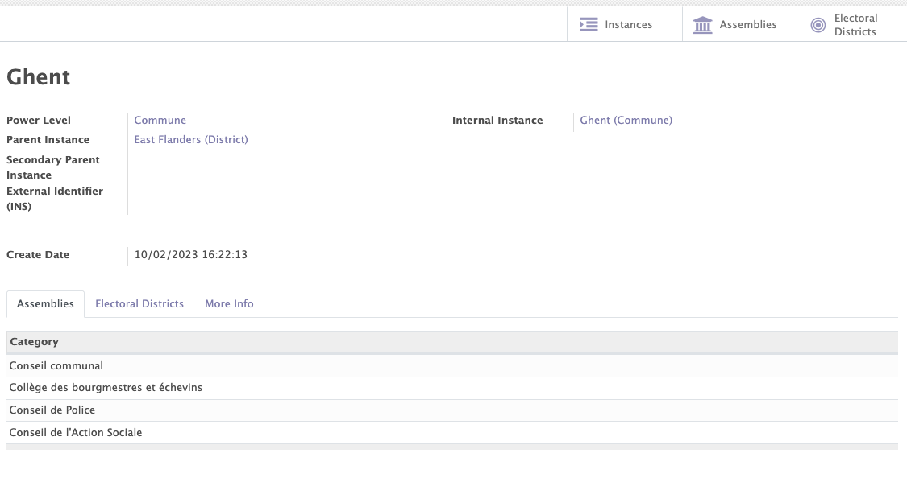
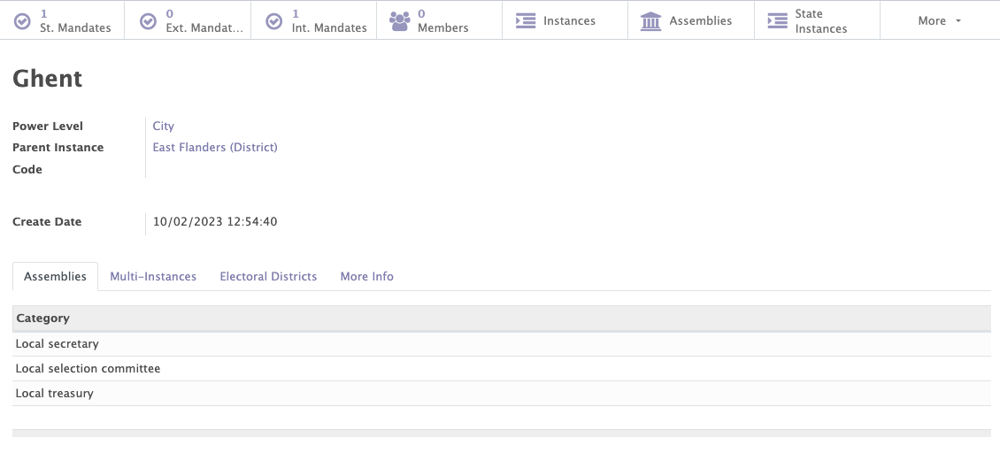
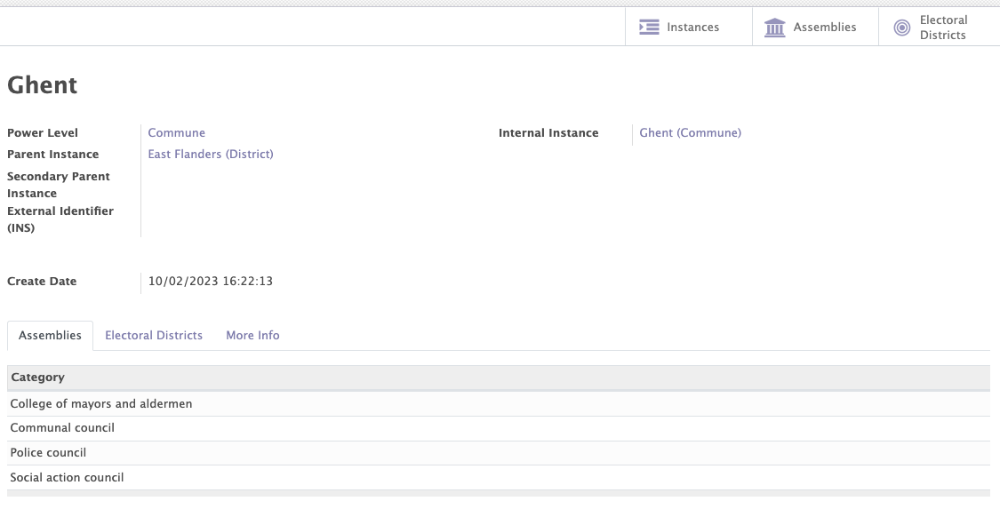
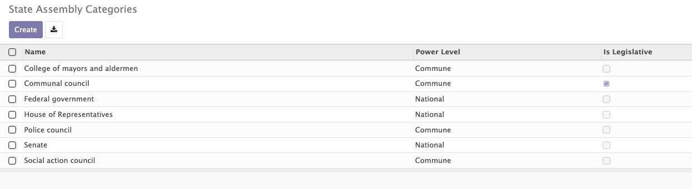
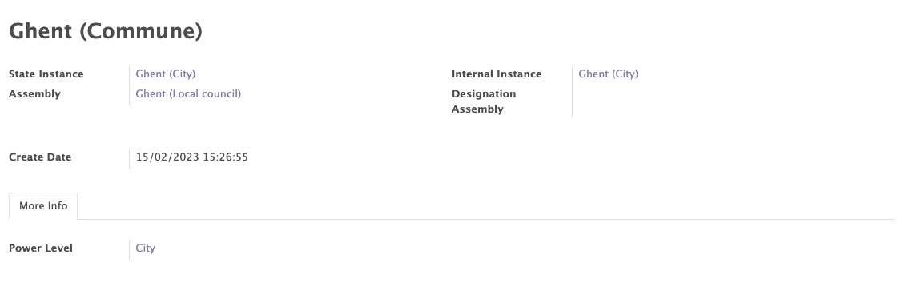
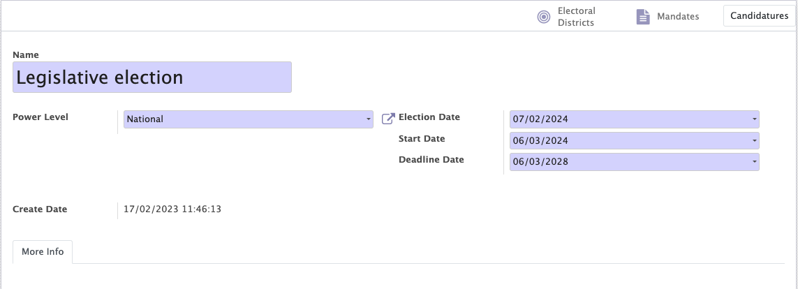

# Structure

The structure module enables you to define how you organisation is organized by creating three types of structures:

- Internal structure of the organisation
- Political structure of the country (for political parties)
- External structure

Those structures are configurable in Mozaïk, they can easily be adapted to the needs of any organisation (parent levels, power levels & assemblies can easily be added etc...). The structures are used in most of the other modules of Mozaïk (contacts, mandates, access rules...).

In the structure module, you will encounter the following terms: 

- Power levels
- Instances
- Assemblies
- Electoral districts (political structure only)
- Legislatures (political structure only)

## Power levels

A power level refers to the different decision-making bodies within an organisation/country. Each level of authority is responsible for managing specific functions or activities.

RAJOUTER UN EXEMPLE POUR LES NIVEAUX DE POUVOIR DANS STRUCTURE INTERNE 

!!! example "Examples"

    In the political structure of Belgium, the power level is represented by the distribution of competences between the federated entities:

    - The Cities
    - The Regions
    - The Communities
    - The Provinces
    - The Federal State

## Instances

An instance is a governance entity responsible for the management of specific functions or activities. It may be composed of elected or appointed members, and is responsible for making important decisions for the organisation.

Instances are always linked to a name and to a power level. They can also be linked to a parent instance, in order to create a hierarchical structure. For example, the Province of East Flanders in Belgium is the parent instance of the city of Ghent.

METTRE UN EXEMPLE POUR UNE INSTANCE DANS LA STRUCTURE INTERNE

<figure markdown>

<figcaption>Example of an instance</figcaption>
</figure>

## Assemblies

Each instance can be associated to an assembly category of the same power level. This combination is generating assemblies, which are collective decision-making instances.

!!!example "Examples"

    In the internal structure of the political party, the city of Ghent (power level = city) could be associated with the following categories of assemblies:

    - Local secretary
    - Local Selection Committee
    - Local treasury

    QUEL SERAIT LE RESULTAT AU NIVEAU DE LA CREATION D'ASSEMBLEES (idem pour l'exemple ci-dessous)?

    In the political structure of Belgium, the city of Ghent (power level = city) could be associated with the following categories of assemblies:

    - The college of mayors and aldermen 
    - The local council
    - The police council
    - The social action council

<figure markdown>

<figcaption>Example of an internal instance with its related category assemblies</figcaption>
</figure>

<figure markdown>

<figcaption>Example of a political instance with its related category assemblies</figcaption>
</figure>

<figure markdown>

<figcaption>Example of assemblies</figcaption>
</figure>

## Electoral districts (only for the political structure)

An electoral district is a division of the territory made for the purpose of an election. Each citizen is attached to one (and only one) electoral district.

The electoral districts can be registered in the "electoral districts" tab of the state structure.

<figure markdown>

<figcaption>Example of an electoral district</figcaption>
</figure>

## Legislature (only for the political structure)

A legislature is a period of time during which the members of a legislative body, such as a national assembly or parliament, exercise their functions.

This feature allows you to add/modify/delete the different legislatures of your political structure.

All political mandates created in Mozaik are always linked to a specific legislature.

<figure markdown>

<figcaption>Example of a legislature</figcaption>
</figure>