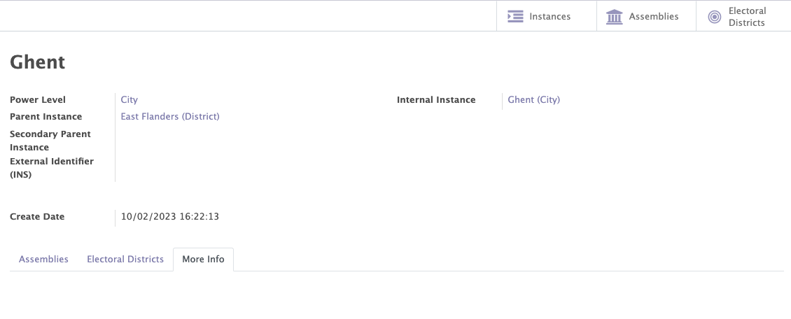
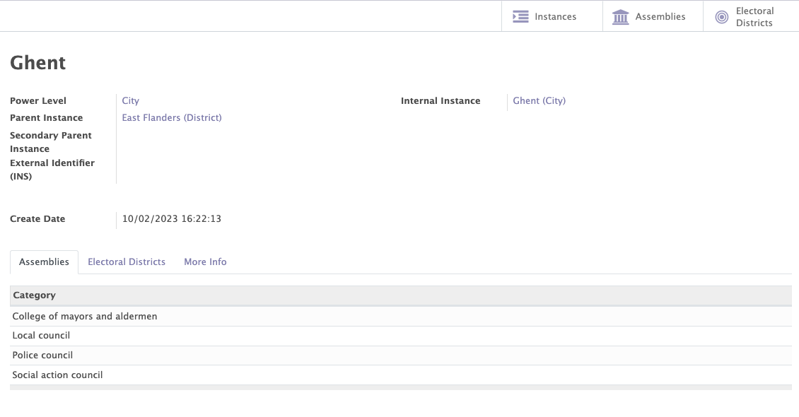
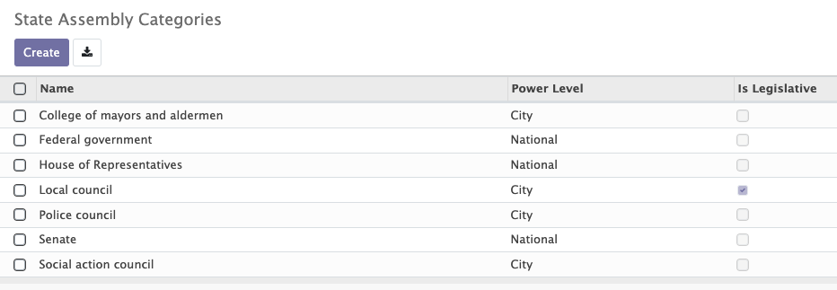
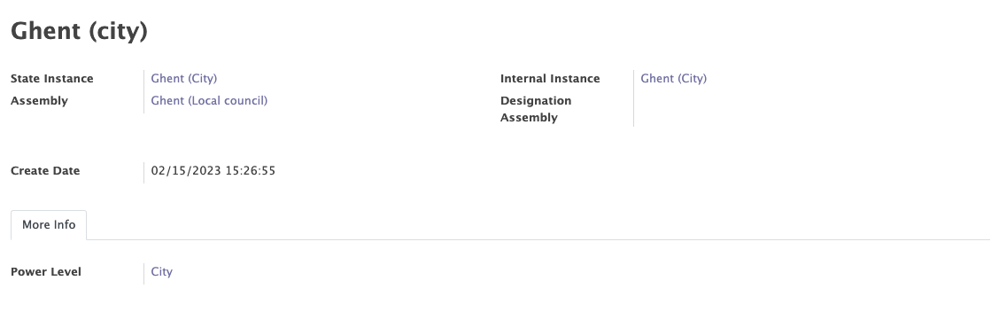

# Structure

The structure module enables you to define how you organisation is organized by creating three types of structures:

- Internal structure of the organisation
- Political structure of the country (for political parties)
- External structure

Those structures are configurable in Mozaïk, they can easily be adapted to the needs of any organisation (parent levels, power levels & assemblies can easily be added etc...). The structures are used in most of the other modules of Mozaïk (contacts, mandates, access rules...).

In the structure module, you will encounter the following terms: 

- Power levels
- Instances
- Assemblies
- Electoral districts (political structure only)
- Legislatures (political structure only)

## Power levels

A level of power refers to the different decision-making and governance bodies within the organisation. Each level of authority is responsible for managing specific functions or activities.

!!! example "Examples"

    In Belgium, the level of power is represented by the distribution of competences between the federated entities:

    - The Regions
    - The Communities
    - The provinces
    - The Federal State

## Instances

An instance is a governance entity responsible for the management of specific functions or activities. It may be composed of elected or appointed members, and is responsible for making important decisions for the organisation.

Instances are always linked to a name and to a power level. They can also be linked to a parent instance, in order to create a hierarchical structure. For example, the Procince of East Flanders in Belgium is the parent instance of the city of Ghent.

<figure markdown>

<figcaption>Example of an instance</figcaption>
</figure>

## Assemblies

The assembly is a collective decision-making instance, which can have a key role in the governance and strategy of the organisation.

Each instance can be associated to an assembly category of the same power level. This combination is generating assemblies.

!!!example "Examples"

    In the internal structure of the political party, the city of Ghent (power level = city) could be associated with the following categories of assemblies:

    - Local secretary
    - Local Selection Committee
    - Local treasury

    In the political structure of Belgium, the city of Ghent (power level = city) could be associated with the following categories of assemblies:

    - The college of mayors and aldermen 
    - The local council
    - The police council
    - The social action council

<figure markdown>

<figcaption>Example of an internal instance with its related category assemblies</figcaption>
</figure>

<figure markdown>

<figcaption>Example of an political instance with its related category assemblies</figcaption>
</figure>

<figure markdown>

<figcaption>Example of assemblies</figcaption>
</figure>

## Electoral districts (only for the political structure)

An electoral district is a division of the territory made for the purpose of an election. Each citizen is attached to one constituency and one constituency only for the purpose of voting.

The electoral districts can be register in the "electoral districts" tab of the state structure.

<figure markdown>

<figcaption>Example of a electoral district</figcaption>
</figure>

## Legislature (only for the political structure)

A legislature is a period of time during which the members of a legislative body, such as a national assembly or parliament, exercise their functions.

This feature allows you to add/modify/delete the different legislatures of the country.

When a mandate is created a legislature will be bound to that mandate thanks to the mandates module of Moziak. 

<figure markdown>

<figcaption>Example of a legislature</figcaption>
</figure>