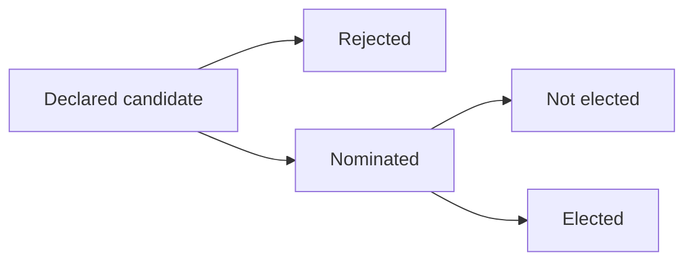

# Mandates

The mandates module allows you to easily manage the different mandates and mandate categories related to your organisation:

- Political mandates (mandates related to your political structure: Mayor, Federal Minister, Senator...)
- Internal mandates (functions occupied within the organisation-internal structure: Chief Secretary, Financial Officer ...  )
- External mandates (functions within an external organisation-external structure: Board Member of another organisation ...)

Several functionalities are available in the mandates module:

- Mandates management (consult, create, remove, edit)
- Selection committees, applicants and elections
- The invalidation of mandates
- The renewal of mandates

For the creation of a mandate, severale fields must be completed on the mandate form:

- The representative
- The designation assembly
- The mandate category
- The legislature (only for political mandates)
- The state assembly
- The start date and deadline date

## Selection committees

Selection committees can be created in Mozaik in order to manage the results of elections (political elections, internal elections):

- Follow-up of candidates
- Results of elections
    - Elected candidates
    - Substitutes
    - Non-elected candidates
- Automatic creation of mandates

Mozaik doesn't have a function yet to organise elections / votes. Only the follow-up of candidates and the result of the votes can be handled in Mozaik. 

Once a candidate is elected/selected, a (political/internal) mandate will automatically be created for this candidate. Selection committees are not mandatary, as mandates can directly be created in Mozaik (without working with candidates and elections).

!!!info

     Once a selection committee is created, you can easily add candidates to this committee by clicking on the "add a new candidature" button.

<figure markdown>

 <figcaption>Creation of a committee</figcaption>
</figure>

<figure markdown>

 <figcaption>Adding new candidates</figcaption>
</figure>

A small workflow has been added in Mozaik to proceed to the follow-up of candidates. 
Once a new applicant is declared, he must first be nominated (= accepted in the short-list), before being eventually elected. 

 <figcaption>Workflow of an applicant</figcaption>

## Invalidation of mandates

Mandates are characterized by three dates: 

- Start date
- End date (effective end date)
- Deadline date (theoretical end date)

In Mozaïk, mandates are automatically closed once the deadline date has been reached. Mandates can also be terminated prematurely by completing the effective end date manually on a mandate.

## Renewal of mandates
Mandates can easily be extended by selecting the 'Renew button' on the contract.

!!! abstract "The goal of this functionality"

    - This functionality allows you to renew a mandate automatically without going through a new election phase.
    - This functionality allows you to create a second mandate for the same person, for the same assembly, at the same period but for another position.
    !!!example

        I want to create a mandate of senator in addition to a mandate of minister for the same person. 

??? tip

    It is possible to create and retrieve all categories of mandates for political, internal and external mandates by navigating in the 'Mandates --> Configurations' menu.