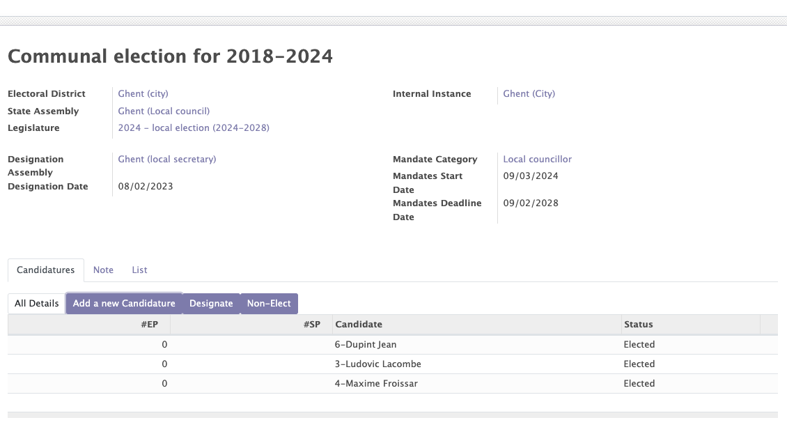
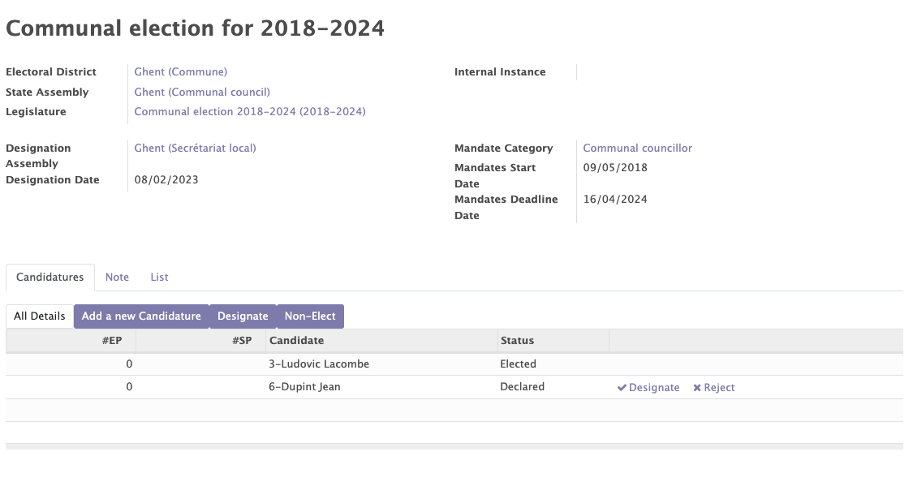

# Mandates

The mandates module allows you to easily manage the different mandates and mandate categories related to your organisation:

- Political mandates (mandates related to your policial structure: Mayor, Federal Minister, Senator...)
- Internal mandates (functions occupied within the organisation-internal structure: Chief Secretary, Financial Officer ...  )
- External mandates (functions within an external organisation-external structure: Board Member of another organisation ...)

Several functionalities are available in the mandates module:

- Mandates management (consult, create, remove, edit)
- selection committees
- Applicants
- The invalidation of mandates
- The renewal of mandates

## Selection committee

In order to elect a person for a mandate, the first step is to create a selection committee. It is created with the information previously created in the Mozaik structure module (Legislature, designation assembly...).

Once the selection committee is created, you can add candidates to this committee by clicking on the "add a new candidature" button.

!!!info

    This whole part is an option offered by Mozaik to better follow-up the election of proxies. However, it is possible to directly create a mandate without going through these steps.

<figure markdown>

 <figcaption>Creation of a committee</figcaption>
</figure>

<figure markdown>

 <figcaption>Adding new candidates</figcaption>
</figure>

## Status of the candidates

Once a new candidate is declared, he must be nominated then elected to create a new mandate. 

 <figcaption>Workflow of an election</figcaption>

<figure markdown>

 <figcaption>Management of the status of the candidates</figcaption>
</figure>

## Invalidation of mandates

The mandates are characterized by three dates: 

- The beginning of mandates.
- The end of the mandates.
- The experition of mandates.

!!! abstract "The goal of this functionality"

    The feature allows to invalidate a mandate :

    - Automatically on the expiry date.
    - Manually by setting an end date before the expiration date.

## Renewal of mandates
The module allows you to renew a mandate by clicking on the "renew" button in the "State Mandates" tab.

!!! abstract "The goal of this functionality"

    - This functionality allows you to renew a mandate automatically without going through the election phase.
    - This functionality allows you to create a second mandate for the same person, for the same assembly, at the same period but for another position.
    !!!example

        I want to create a mandate of senator in addition of a mandate of minister for the same persoon at the same period. 

??? tip

    It is possible to create and retrieve all categories of mandates for political mandates - internal and external by clicking on "configurations" then "categories of mandates"