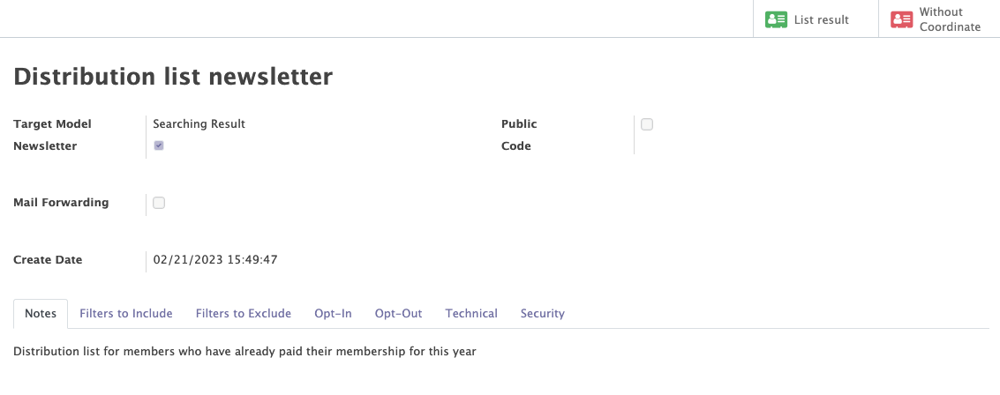

# Distribution lists

The Mozaik distribution list module offers additional functionalities to complement the Odoo standard 'diffusion lists' from the Email marketing module. 
This module enables to create lists of contacts that meet very specific and detailed criteria. To build this domain, you can:

- Use dynamic filters
- Build time-related filters
- Define multi-model domains
- Include / Exclude specific people (opt in / opt out) from distribution lists 

## Distribution lists

This module enables you to generate, edit, and oversee the distribution lists associated with your organisation.

The distribution list module grants access to essential details, including:

- The distribution list's key information, such as its name and notes.
- The multiple 'include' and 'exclude filters' linked to each distribution list
- The roster of contacts encompassed within the distribution list.

!!! abstract "The goald of the distibution list" 

    Distribution lists are a powerful tool that can help you efficiently communicate with a targeted group of contacts. These lists are created based on a set of predetermined rules established by inclusion or exclusion filters that determine which contacts should be added or removed from the list.

    Once a distribution list has been created, it can be leveraged to target a specific group of contacts for mass communication. This can be especially helpful when using the <a href=https://mozaik-association.github.io/mozaik/email-marketing tagret="_blank">marketing email module</a>, allowing you to send tailored messages to the right people.    
 
DEVELOPPER LES 4 POINTS CI-DESSOUS POUR BIEN EXPLIQUER EN QUOI CES LISTES DE DISTRIBUTION SONT INTERESSANTES / MIEUX QUE LE STANDARD:
Use dynamic filters
Build time-related filters
Define multi-model domains
Include / Exclude specific people (opt in / opt out) from distribution lists

<figure markdown>

 <figcaption>Distribution list form with general information</figcaption>
</figure>

## Include and exclude filters
 
A distribution list enables you to apply filters that help you define a dynamic domain of contacts that meet specific criteria. Those filters can be added (include filters) or removed (exclude filters) from a distribution list. 

Those filters can be saved as templates, in order to be re-used in the future for other distribution lists. Once the filters are applied on your distribution list, you can view all the contacts that are present in the 'include filters' and that currently don't correspond to any 'exclude filter domain.

Multiple filters can be use to fine-tune the filter domain and ensure that only relevant contacts are included in the distribution list.

In order to create a filter, you must first select a 'virtual model' (combination of two Odoo models) on which the filter will be based. Filters can be taken from different models: 

- Partners/Memberships
- Partners/Mandates
- Partner/Mass Maillings
- Partner/Involvement
- Partner/Relation 
- Partner/Instance 
- Assembles/instances 

Once your filters have been applied on your virtual model, you can easily transform (through the 'action' button) those filters into an 'Include' or 'Exclude filter' that will be linked to a distribution list. 

!!!example

    In order to create a window to include contacts with voluntary participation, the virtual Partners/Involvement template must be selected. Then create the rule with the criterion "Involvement type" and the condition "= Voluntary work".
    
    METTRE UN EXEMPLE PLUS COMPLIQUE, ET EN PARLANT PLUTÖT DE CE QUI INTERESSE LE PLUS LES LECTEURS, CAD LES MEMBERSHIPS. DONC PLUTOT REPRENDRE TOUS LES ADHERENTS EN ORDRE DE COTI (DONC PAID = TRUE) QUI ONT ENTRE 30 ET 50 ANS ET QUI SONT LIES A UNE DES 19 COMMUNES DE BXL (DONC LIé A UNE INSTANCE ENFANT D'UNE INSTANCE DE LA REGION DE BXL CAPITALE)
!!!info

    These filters are dynamic, meaning that contacts that will match the filter criteria in the future will automatically be added/rejected from the distribution list.

POUR L'EXEMPLE, CONTINUE AVEC L'EXEMPLE CI-DESSOUS EN INDIQUANT PAR EXEMPLE QUE QUELQU'un QUI DEPASSE 50 ANS QUITTERA LA LISTE DE DISTRIBUTION AUTOMATIQUEMENT
    !!!example

        Suppose you want to create a filter that includes all contacts in good standing who voluntarily participate in a program. As more contacts meet these criteria, they will be added to the distribution list automatically while removing contacts that no longer meet the filter rule(s).

??? tip

    By clicking on the "Result" button on a specific filter or a distribution list, you can access the list of all the contacts that are included in the domain. 

    :warning: To be included in the 'Result' list, a contact must have an email address OR a postal address. Otherwise, the contacts will appear in the "Without coordinate" tab accessible on a specific filter or on the distribution list.

CHANGER LE SCREENSHOT POUR METTRE UN EXEMPLE PLUS COMPLEXE (REPRENDRE IDEALEMENT CELUI D'AU-DESSUS AVEC LES ADHESIONS)
<figure markdown>

<figcaption>Creation of a filter</figcaption>
</figure>
<figure markdown>

<figcaption>Distribution list form with a filter</figcaption>
</figure>

## The mass export function

Once a distribution list has been created, users can benefit from a 'mass export' function to easily obtain a structured file (CSV format) with the list of contacts included in the distribution list. This features is particularly interesting for exports from email coordinates and postal coordinates (contacts can be grouped by co-residency). Several filters (internal instance, exclude bounced addresses...) can be applied  to restrict the list of contacts that need to be exported. 

with a tool that allows them to export a whole series of information from the contacts in the distribution list. This tool can generate a structured file (CSV) for an external printing tool (printing of membership cards).

<figure markdown>

 <figcaption>Exporting of the distribution list</figcaption>
</figure>

??? question "How to use this functionality ?"

    You can access this export functionality by clicking on the "mass action" button on a distribution list form (top left, right below the "edit" button)