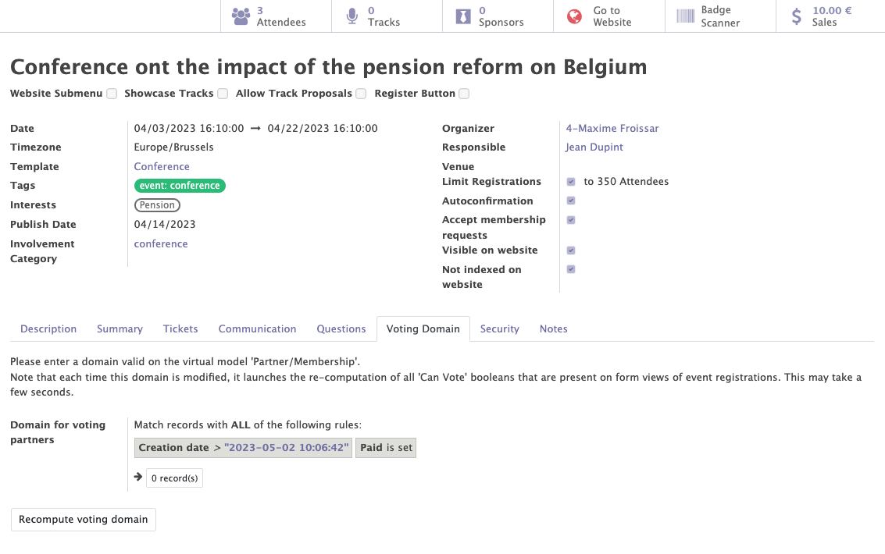

# Events

The events module uses the odoo standard and adds specific features for the organisations linked to Mozaik. It allows you to manage the events of your organisation.

It will provide access to :

- The general information of the events
- The management of tickets
- The automated communications
- The list of questions
- The voting domain
- The access limitations

## General information of the events

This functionality allows you to create, modify and manage all the events related to your organisation.

Various information can/must be completed on a event form :

- The standard information of the event (name, dates, organizer...)
- The interests related to the event.
- The involvement categories related to the event.

!!! abstract "The goal of event management"

    This fonctionnnality allows to :

    - Manage the general information of each event.
    - Add tags/interests to categorise the different events and add these interests to the form of the contacts who attended to this event.
    - Add involvement categories to automatically add them to the form of the contacts who participated to the event.
    - Get access to the lists of all the attendees and sponsors of each event.

<figure markdown>

<figcaption>Event form with general information</figcaption>
</figure>

## Management of tickets

!!!abstract "The goal of this fonctionality"

    The fonctionality allows to create differents types of tickets for an event. Tickets can have differents prices, different maximum number of entries and different start and end dates of the sale. 

<figure markdown>

<figcaption>Example of tickets for an event</figcaption>
</figure>

## Automated communications

Automatic emails can be added in the "communications" tab by selecting an already created template or by creating a new one. 

!!! abstract "The goal of the the automated communication"

     This feature allows emails to be sent automatically at certain times during the event.
    !!! example

        - I would like to send a registration email immediately after each registration.
        - I would like to send a reminder email 5 days before the event. 

<figure markdown>

<figcaption>Example of automated communications</figcaption>
</figure>

## Questions

The module allows you to add questions in the "questions" tab that participants can or must answer. Answers can be free text, multiple choice or a tickbox.

!!! abstract "The goal of the questions"

    The questions allow you to learn more about the contacts involved to your event. 

    For the selected answers and tickboxes, it is possible to add a participation category and thesaurus therms depending on the answer chosen by the participant. This information will be displayed on the contact's form.
    !!! example 

        People answering "yes" to the question "Would you like to stay informed about the other events about pensions?" will receive a category of participation and an interest in this subject.
        <figure markdown>
        
        <figcaption>Adding a participation category and an interest based on the response</figcaption>
        </figure>

<figure markdown>

<figcaption>Example of questions</figcaption>
</figure>

## The voting domain

A voting domain can be registered in the "voting domain" tab by adding filters to select only certain people according to their information.

!!! abstract "The goal of the voting domain"

    This feature allows you to add votes to the event only for certain people (the contacts listed in the filters). Depending on whether he/she is included in the list of voting areas, he/she will have the right to vote or not.  This information will be displayed when a person arrives at the event organised by the organisation and their barcode is scanned.
    !!! example 

        I want only people who are in order to pay and who are donors to vote.
        <figure markdown>
        
        <figcaption>Example of voting domain</figcaption>
        </figure>

## The access limitations

Thanks to the "security" tab, it is possible to limit the visibility and access of each event to certain people depending on the selected instance. 

!!! example 

    I want that only people from the Antwerp instance can access to the event.

<figure markdown>

<figcaption>Example of an access limitation</figcaption>
</figure>