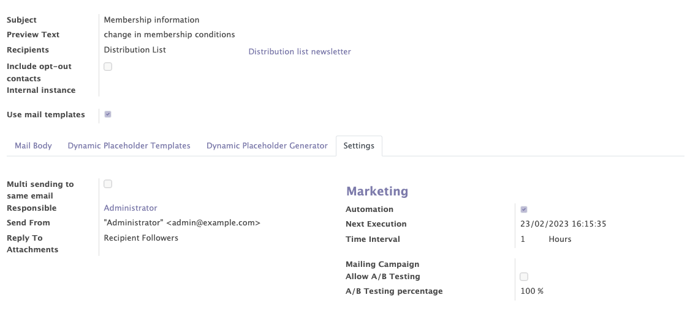

# Email marketing

The email marketing module from Odoo enables users to manage the marketing emails of their organisation.
Several interesting functionalities have been added by Mozaik to this Odoo standard module:

- Distribution lists can be used, in addition to the diffusion lists offered by the Odoo standard
- You can work with the 'standard Odoo email builder', as well as with the 'Email templates' proposed by Odoo
- A 'recurring' function has been added on the mass mailings
- Previous email campaigns can be used to target specific contacts for a new mass mailing campaign
- You can include opt-out contacts into specific mass mailings

## General information

This functionality allows you to create, modify and manage the mass mailings sent by your organisation.

The email marketing module provides access to general information as:

- The general information of the emails marketing (subject, preview text, recipients...).
- The inclusion of opt-out contacts or not. You can decide to include contacts even if they have an op-out communication preference on their contact's form.
- The use of the mail template or not. The simplified mail editor allows you to create mail templates in advance and simply select the one you need when creating a new mass mailing.

!!! info 

    A "global opt-out" box can be checked on a member's form to be blacklisted from receiving mass communications from the organisation. However, the contact will still receive the usual emails

<figure markdown>

 <figcaption>Marketing email form with general information</figcaption>
</figure>

## Recurrent mailings

In the mailing configurations, it is possible to select the "recurrent sending" option by selecting the date of the next mailing and the time interval between mailings.

!!! abstract "The goal of recurrent mailing"

    This functionality allows you to send automatically an email evey X hour/day/week/month/year. 

    Recurring emails are sent only once to each contact on a distribution or mailing list. The idea of this feature is to send a communication only to new people who meet the rules of a distribution list. 
    
    The email marketing module, added to the distribution list module, allows you to send a recurring email to a specific distribution list that is constantly updated thanks to the dynamic filters.

    !!!example "Examples"

        - I want to automatically send a 'thank you' email to all the people who paid their membership in the last 24 hours.

        To do this you will have to create a distribution list that includes - thanks to the include filters - the people who paid their membership in the last 24 hours (=time-related filter). The filters being dynamic, the distribution list will be constantly updated. Once the distribution list is created, you can add a reccurence of 24 hours on the mass mailing campaign.

       - I want to automatically send an email to all people who have recently signed a peitition, who are ex-members and who are over 30 years old. 

<figure markdown>

 <figcaption>Example of recurrent mailing</figcaption>
</figure>  

## Management of failures

All communication failures (email / postal) can be recorded in the application. This information is visible on the contact's form of each contact, in the "communication" tab. If a contact does not receive an email (bounce) or a letter, a communication failure can be recorded on his contact's form.

!!! abstract "The goal of failure management"

    This functionality allows you to register the communication failures of each contact. Thanks to this functionality, you can automatically blacklist a contact after a certain number of failures to stop sending him emails or letters that he will not receive.

How to encode failures on a contact? 

- Postal bounces: must be encoded manually
- Email bounces: records are updated automatically by Mozaik

<figure markdown>

 <figcaption>Example of encoded failures</figcaption>
</figure>  

<figure markdown>

 <figcaption>Email bounced description</figcaption>
</figure>  

## Reporting

The module offers :

- A reporting tab to get a global analysis of the different mails with several measures over the time (number of sendings, returns, openings...).
- An individual report for each mail sent with different information such as the opening rate, the click rate, the return rate ....

<figure markdown>

 <figcaption>Example of an individual report</figcaption>
</figure>  