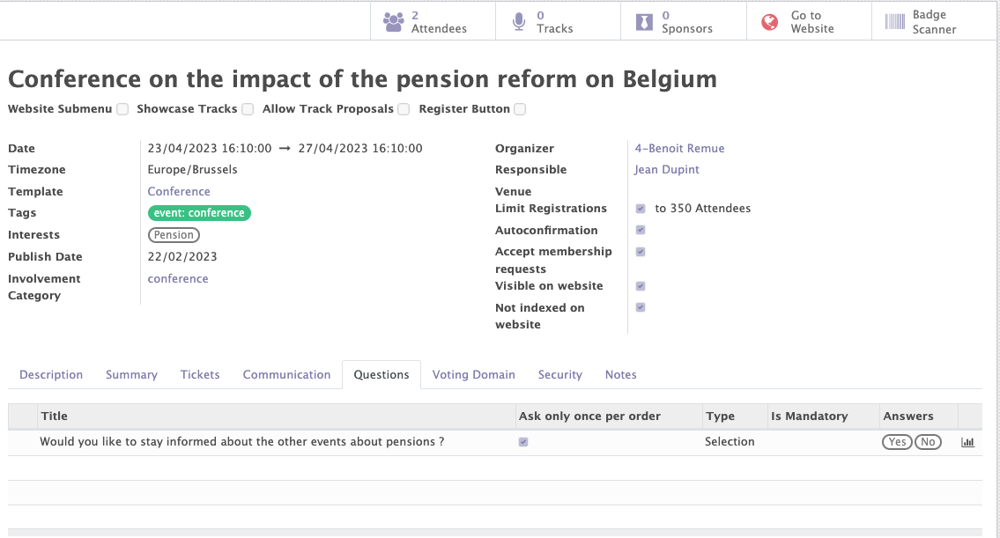

# Events

The Mozaik Events module differs from the Odoo standard module by several points. The following functionalities have been added:

- The automatic collection of informations (interests / participations of members) based on the questions answered during  a specitic event registration.
- A voting domain, in order to know which members are allowed to vote during an event.
- The event access management, in order to limit access to certain people according to their access rules (< local instance)

## General information on the events

This functionality allows you to create, modify and manage the events related to your organisation.

Various informations can be completed on an event form :

- The standard information of the event (name, dates, organizer...)
- The interests related to the event.
- The involvement categories related to the event.

The interests and involvement categories linked to an event will automatically be added to all the contacts registering for this event. Those informations can be used to send communications in a very targetted manner. 

<figure markdown>

<figcaption>Event form with general information</figcaption>
</figure>

## Questions

In the Event module from Odoo, questions can be added in order to collect information during the event registration process on your website.

In the Mozaik module, the answers to each questions can be linked to interests and participations. This feature allows to collect some very precise information about each contact, based on the answer they provide to each question of the event registration form.
!!! example 

    People answering "yes" to the question "Would you like to stay informed about the other events about pensions?" can be marked as "interested by the 'Pension' subject". They will be included in all mailing lists dealing with this subject.
    <figure markdown>
    
    <figcaption>Adding an interest to a contact, based on his response to a specific question</figcaption>
    </figure>

<figure markdown>

<figcaption>Example of questions</figcaption>
</figure>

## The voting domain

A voting domain can be registered in the "voting domain" tab on an event, to indicate which members are allowed to vote during an event. This information will be displayed when the barcode on the badge of the participant is scanned / when the participant's name is encoded in the system.

!!! example 

    I only want to allow people who are members since more than 5 years to vote.
    <figure markdown>
    
    <figcaption>Example of a voting domain</figcaption>
    </figure>

## The access limitations

Thanks to the "security" tab, it is possible to limit the visibility and access of each event to certain people depending on their access rights.
This access rules are based on the internal structure of the organization. A user linked to a very low internal intance will only be able to access the events linked to his instance. A user linked to the 'regional' internal instance will be able to access all the events of his region etc.

!!! example 

    I only want people from the Antwerp instance (and the parent instances of Antwerp) to access this event in Odoo.

<figure markdown>

<figcaption>Example of an access limitation</figcaption>
</figure>