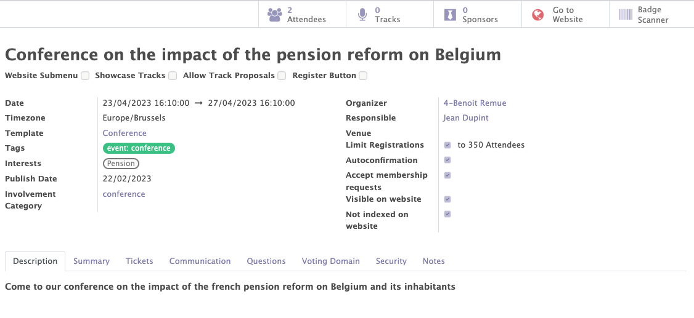

# Events

The Mozaik events module uses the Odoo standard and adds specific features for political parties and other organizations. It allows you to manage the different events of your organisation.

The Mozaik Events module differs from the Odoo standard module by several points :

- The management of the communication in order to automatically send emails according to certain triggers defined during an event. --> C'EST DU STANDARD CA, DONC PAS DU TOUT SPECIFIQUE
- The management of questions asked to attendees in order to learn more about them. --> TOUT A FAIT STANDARD AUSSI (CE QUI N'EST PAS STANDARD C'EST LE FAIT DE LIER LES QUESTIONS A DES PARTICIPATIONS OU INTERETS QUI PERMETTENT DE COLLECTER DES INFOS SUR LES CONTACTS QU'ON AJOUTE ENSUITE SUR LEUR FICHE CONTACT )
- The management of the voting domain in order to allow certain people to participate in votes or not during the event.
- The event access management, in order to limit access to certain people according to their access rules (< local instance)

RAJOUTER AUSSI LE LIEN AVEC LES PARTICIPATIONS (ET CE QUE CA RAPPORTE AU PARTI POLITIQUE D'AVOIR CE LIEN)

## General information of the events

This functionality allows you to create, modify and manage the events related to your organisation.

Various information can be completed on a event form :

- The standard information of the event (name, dates, organizer...)
- The interests related to the event.
- The involvement categories related to the event.

--> PLUS D'INFOS SUR CE QUE CELA IMPLIQUE D'AVOIR LES INTEREST ET LES INVOLVEMENTS  SUR LES EVENTS ET SUR LES QUESTIONS D'EVENTS (REPRENDRE CE QUE T'AS MIS DANS GOAL OF THE EVENT MANAGEMENT QUI PEUT ËTRE ENLEVE)

!!! abstract "The goal of event management"

    This functionality allows to :

    - Manage the general information of each event.
    - Add tags/interests to categorise the different events and add these interests to the form of the contacts who attended to this event.
    - Add involvement categories to automatically add them to the form of the contacts who participated to the event.
    - Get access to the lists of all the attendees and sponsors of each event.

<figure markdown>

<figcaption>Event form with general information</figcaption>
</figure>

## Automated communications

C'EST TRES BIEN ECRIT, MAIS C'EST STANDARD NON?

Automatic emails can be added in the "communications" tab by selecting an already created template or by creating a new one. 

!!! abstract "The goal of the the automated communication"

     This feature allows emails to be sent automatically at certain times during the event depending on certain triggers.
    !!! example

        - I would like to send a registration email immediately after each registration.
        - I would like to send a reminder email 5 days before the event. 

<figure markdown>

<figcaption>Example of automated communications</figcaption>
</figure>

## Questions

The module allows you to add questions in the "questions" tab that participants can or must answer. Answers can be free text, multiple choice or a tickbox.

LA PARTIE QUI EXPLIQUE COMMENT ON EXPLOITE LES INLVOLEMENTS ET INTEREST N'EST PAS CLAIRE DU TOUT. IL FAUT MIEUX EXPLIQUER CETTE PARTIE-LA

!!! abstract "The goal of the questions"

    In addition to the simple fact of asking questions to the participants of the event, Mozaik allows to really collect reusable information about the participants.

    For the selected answers and tickboxes, it is possible to add a participation category and thesaurus therms depending on the answer chosen by the participant. This information will be displayed on the contact's form.
    !!! example 

        People answering "yes" to the question "Would you like to stay informed about the other events about pensions?" will receive a category of participation and an interest in this subject.
        <figure markdown>
        
        <figcaption>Adding a participation category and an interest based on the response</figcaption>
        </figure>

<figure markdown>

<figcaption>Example of questions</figcaption>
</figure>

## The voting domain

A voting domain can be registered in the "voting domain" tab on an event, to indicate which members are allowed to vote during an event. This information will be displayed when the barcode on the badge of the participant is scanned / when the participant's name is encoded in the system.

    !!! example 

        I only want to allow people who are members since more than 5 years to vote.

        METTRE UN SCREENSHOT PLUS PARLANT DU COUP POUR REPONDRE AU CAS DE FIGURE CI-DESSUS QUI ME SEMBLE PLUS INTERESSANT (MEMBRE DEPUIS 5 ANS)

        <figure markdown>
        
        <figcaption>Example of a voting domain</figcaption>
        </figure>

## The access limitations

Thanks to the "security" tab, it is possible to limit the visibility and access of each event to certain people depending on their access rights.
This access rules are based on the internal structure of the organization. A user linked to a very low internal intance will only be able to access the events linked to his instance. A user linked to the 'regional' internal instance will be able to access all the events of his region etc.

METTRE LE SCREENSHOT EN ANGLAIS (COMMUNE A METTRE EN ANLGAIS STP)

!!! example 

    I want that only people from the Antwerp instance can access to the event.

<figure markdown>

<figcaption>Example of an access limitation</figcaption>
</figure>