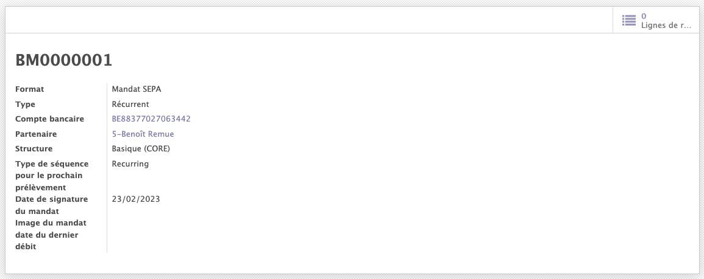
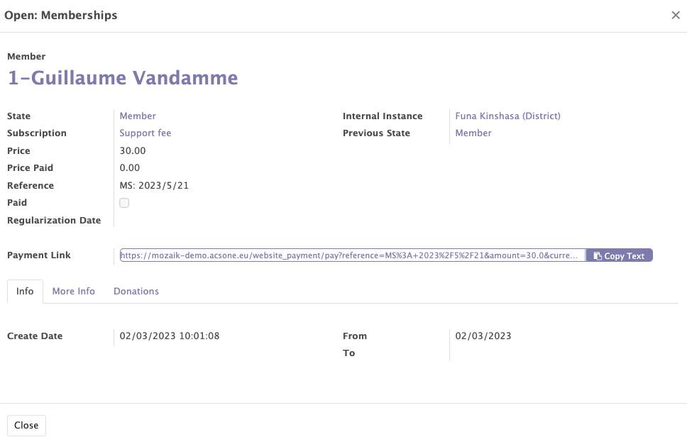

# Invoices

The Mozaik invoicing module offer some additional functionalities suitable for the organisations/political parties to complete the Odoo standard :

- The creation of SEPA mandates
- The management tool for direct debit refusals
- The reporting on membership payments 

## Creation of SEPA mandates 

When creating a membership, you will be asked to fill in a field with a bank account number. Once this bank account is completed and the membership created, a SEPA mandate is automatically created.

!!! info 

    With SEPA Direct Debit, a creditor can collect in any country in the SEPA area, provided that a valid mandate is in place.

<figure markdown>

<figcaption>Example of a SEPA mandate</figcaption>
</figure>

## Management tool for direct debit refusals

For the payment of memberships, it is possible to create a payment link that redirects to an Odoo payment page in order to make the payment with a payment intermediary compatible with Odoo.

!!!info 

    In case the annual payment of a contact is refused, a refusal management workflow is activated. 

    - An email is sent to the contact asking him to pay his membership since it has not been paid.
    - The direct debit is stopped (the SEPA mandate is cancelled).
    - A new membership line is opened. 

<figure markdown>

<figcaption>Example of a membership line with the payement link</figcaption>
</figure>

## Reporting on membership payments

The invoicies module of Mozaik offers the possibility to do analytical analysis on the accounting entries corresponding to the payment of memberships.

!!!abstract "The goal of the reporting"

    This feature allows you to create reports with different measures on the payment of membership fees. 

    - Average price
    - Product quantity
    - Untaxed total
    - Count