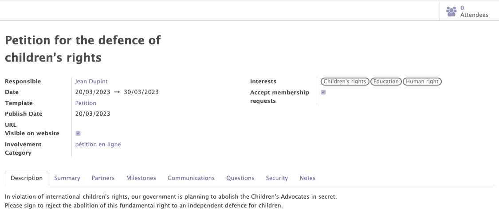
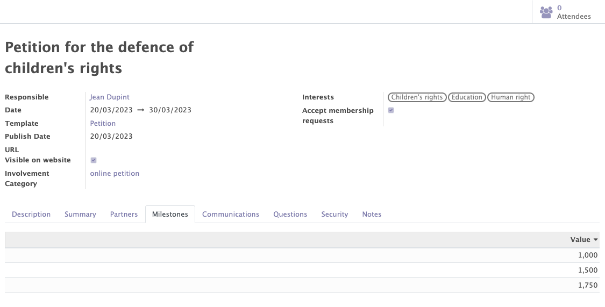
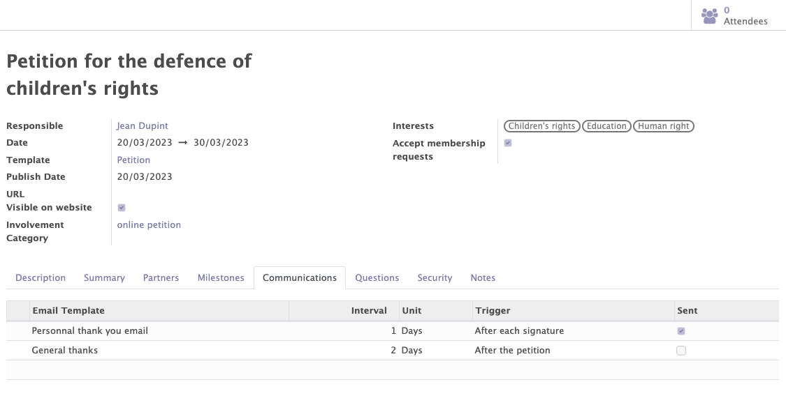
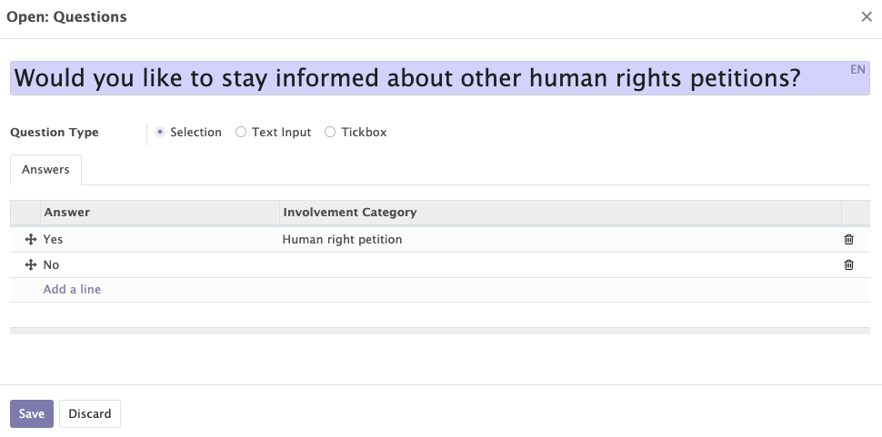
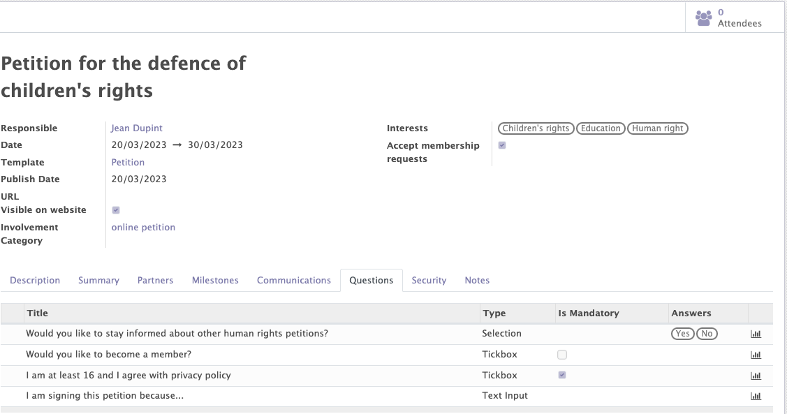
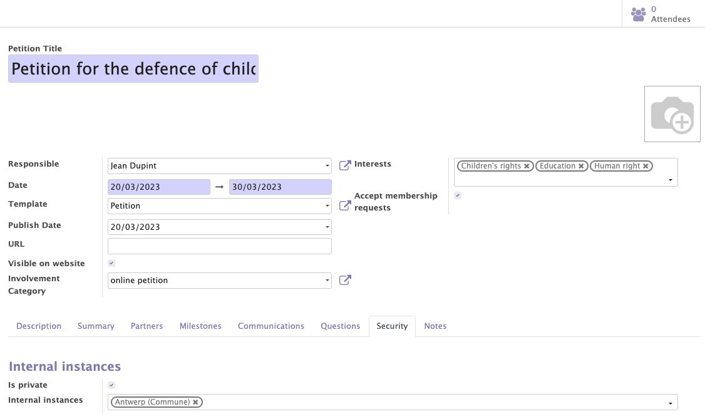

# Petitions

The petition module is a brand new module developed in Mozaik. This module offers the possibility to create and manage the various petitions of your organization.

This module handles:

- The general information of a petition
- The management of the petition signatories
- The recognition of signatories having signed the petition in order to link them to existing contacts
- The questions asked to petition signatories in order to learn more about them
- The communication management, in order to automatically send emails according to certain triggers defined on the petition
- The milestones management to define the milestones to be reached in terms of numbers of signatures
- The petition access rules, in order to limit access to certain people

## General information of the petition

This functionality enables users to create, modify and manage the different petitions related to their organization / political party.

Various informations can be completed on a petition :

- The standard information of the petition: name, responsible, description, dates...
- Interets related to the petition : Those interests will automatically be copied on a contact's form when a contact decides to sign a specific petition. This helps users better understand the interests of the contacts of their organization. This can also be used for communication purposes.
- The involvement categories related to the petition. Involvement categories are automatically added on contacts signing the petition.This information can be used for communication purposes.

<figure markdown>

<figcaption>Petition form with general information</figcaption>
</figure>

## Recognition of partners

When a person participates to a petition, the system will try to detect (based on several criteria) whether this person can be linked to an existing partner in the Odoo database. If this is not the case, a new partner will automatically be created.

Thanks to this feature, you can expand your organization's list of contacts and then recontact them for future petitions, events, surveys...

## Milestones

The functionality allows you to add different milestones (target number of signatures) to be reached for each petition.

!!! info

    At least one milestone must be added to create the petition. Milestones are only used for information purposes.

<figure markdown>

<figcaption>Example of milestones for a petition</figcaption>
</figure>

## Automated communications

Automatic emails can be added in the "communications" tab by selecting an already created template or by creating a new one. 

This feature allows emails to be sent automatically, based on certain triggers.

    !!! example

        - I would like to send an email 2 days after the end of the petition to all participants
        - I want to send an email to each participant one day after their signing to ask them to share the petition with others

<figure markdown>

<figcaption>Example of automated communications</figcaption>
</figure>

## Questions

The module allows you to add questions in the "questions" tab that participants can or must answer. Answers can be free text, multiple choices or a tickbox.

!!! abstract "The goal of the questions"

    These questions allow you to learn more information about the contacts involved in your petitions. 

    For the selected answers and tickboxes, it is possible to add an involvement and interest, depending on the answer chosen by the participant.  This information will be displayed on the contact's form.
    !!! example 

        People answering "yes" to the question "Would you like to stay informed about other human rights petitions?" will receive 'Human rights' as a new interest on their contact form and will have a new involvement 'Send future human rights petitions'
        <figure markdown>
        
        <figcaption>Adding a participation category based on the response</figcaption>
        </figure>   

<figure markdown>

<figcaption>Example of questions</figcaption>
</figure>

## The Access limitations
Thanks to the "security" tab, it is possible to limit the visibility and access of each petition to certain people depending on their access rules.

!!! example 

    I want that only people from the Antwerp instance can access the petition. METTRE "COMMUNE" DANS LE SCREENSHOT EN ANGLAIS

<figure markdown>

<figcaption>Example of an access limitation</figcaption>
</figure>