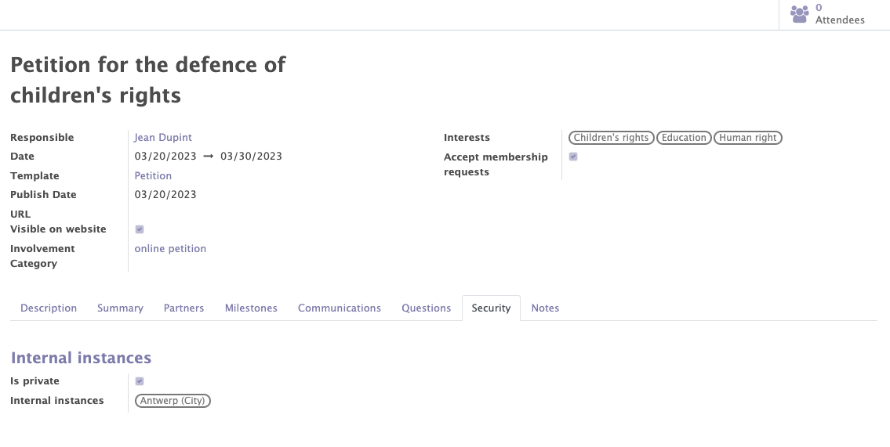

# Petitions

The petition module is a new module fully developed in the context of the Mozaik project. This module offers the possibility to create and manage the petition of your orgaisation from the Odoo back end. 

This module will take care of:

- The management of the petition signatories.
- The recognition of the new partners having signed the petition in order to create a contact form for them.
- The management of questions asked to petition signatories in order to learn more about them.
- The management of the communication in order to automatically send emails according to certain triggers defined during the petition.
- The petition access management in order to limit access to certain people according to the internal instances.
- The milestones management to define the milestones to be reached in terms of number of signatures.

## General information of the petition

This functionality provide you to create, modify and manage the petitions related to your organisation.

Various informations can/must be completed on the petition form :

- The standard information of the petition (name, responsible, description, dates...).
- Interets related to the petition.
- The involvement categories related to the petition.

!!! abstract "The goal of petitions management"

    This functionality provides you to :

    - Manage the general information of each petition.
    - Add interests to categorise the different petitions and to add these interests to the form of the contacts who participated to this petition.
    - Add involvement categories to automatically add them to the form of the contacts who participated to the petition.
    - Get access to the lists of all the attendees/signatories of the petition.

<figure markdown>

<figcaption>Petition form with general information</figcaption>
</figure>

## Recognition of partner

When a person participates to the petition, the module allows to detect, on the basis of several criterias, if the participant already exists in the list of contacts or not. If the latter does not exist, a contact form is created for him. 

!!! abstract "The goal of partner recognition"

    Thanks to this feature you can expand your organisation's list of contacts and then recontact them for other petitions, events, surveys...

## Milestones

The functionality allows you to add different milestones (target number of signatures) to be reached for each petition.

!!! info

    At least one milestone must be added to create the petition. However, they are for information purposes only. They do not generate/create anything.

<figure markdown>

<figcaption>Example of milestones for a petition</figcaption>
</figure>

## Automated communications

Automatic emails can be added in the "communications" tab by selecting an already created template or by creating a new one. 

!!! abstract "The goal of the the automated communications"

    This feature allows emails to be sent automatically at certain times during the petition depending on certain triggers.
    !!! example

        - I would like to send an email 2 days after the end of the petition to all participants to reveal the results of the petition.
        - I want to send an email to each participant one day after their signing.

<figure markdown>

<figcaption>Example of automated communications</figcaption>
</figure>

## Questions

The module allows you to add questions in the "questions" tab that participants can or must answer. Answers can be free text, multiple choices or a tickbox.

!!! abstract "The goal of the questions"

    The questions allow you to learn more about the contacts involved in your petitions. 

    For the selected answers and tickboxes, it is possible to add a participation category and thesaurus themes depending on the answer chosen by the participant.  This information will be displayed on the contact's form.
    !!! example 

        People answering "yes" to the question "Would you like to stay informed about other human rights petitions?" will receive a category of participation and an interest in this subject.
        <figure markdown>
        
        <figcaption>Adding a participation category based on the response</figcaption>
        </figure>   

<figure markdown>

<figcaption>Example of questions</figcaption>
</figure>

## The Access limitations
Thanks to the "security" tab, it is possible to limit the visibility and access of each petition to certain people depending on the selected instance. 

!!! example 

    I want that only people from the Antwerp instance can access the petition.

<figure markdown>

<figcaption>Example of an access limitation</figcaption>
</figure>