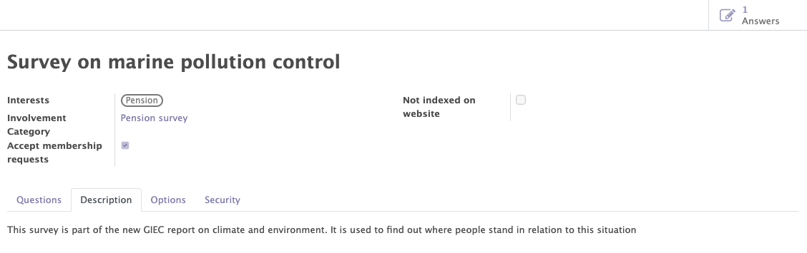

# Surveys

The Odoo standard surveys module enables you to manage the different events of your organisation. The Mozaik module adds a few new features:

- The automatic recognition of partners
- The management of the questions of the survey in order to collect reusable data from the attendees.
- The surveys access management in order to limit access to certain people according to the internal instances.

## General informations of the survey

This functionality allows you to create, modify and manage the surveys related to your organisation.

Various informations can/must be completed on the survey form :

- The standard information of the survey (name, descirption...).
- The interests related to the survey.
- The involvements categories related to the survey.

The interests and involvement categories linked to the surveys allow the organisations to find all the contacts with certain categories of participation or interests in order to send communications in a verry targeted manner.

This functionality allows to :

- Manage the general information of each survey.
- Add interests to categorise the different survey and to add these interests to the form of the contacts who participated to this survey.
- Add involvement categories to automatically add them to the form of the contacts who participated to the survey.
- Get access to the lists of all the answers of the survey.

<figure markdown>

<figcaption>Survey form with general information</figcaption>
</figure>

## The managment of the questions

The different questions of the survey can be added and arranged in the desired order. For each question, it is possible to propose differents types of answers (free text, multiple choices, date...).

The questions have differents roles:
    
- To find out the participant's opinion on the questions asked.
- To get to know more about the participants in the survey through the interests and then benefit from them in the communications sent to the organisation's contacts 

!!!info 

    It is possible to add participation categories and interests according to the answers chosen by the participants. 
    <figure markdown>
    
    <figcaption>Adding involvement & interest</figcaption>
    </figure>

<figure markdown>

<figcaption>Example of questions for the survey</figcaption>
</figure>

## Recognition of partner

When a person participates to a petition, the system will try to detect (based on several criteria) whether this person can be linked to an existing partner in the Odoo database. If this is not the case, a new partner will automatically be created.

Thanks to this feature, you can expand your organization's list of contacts and then recontact them for future petitions, events, surveys...

## The access limitations

Thanks to the "security" tab, it is possible to limit the visibility and access of each survey to certain people depending on the selected instance. 

!!! example 

    I want that only people from the Antwerp instance can access the survey.

<figure markdown>

<figcaption>Example of an access limitation</figcaption>
</figure>

