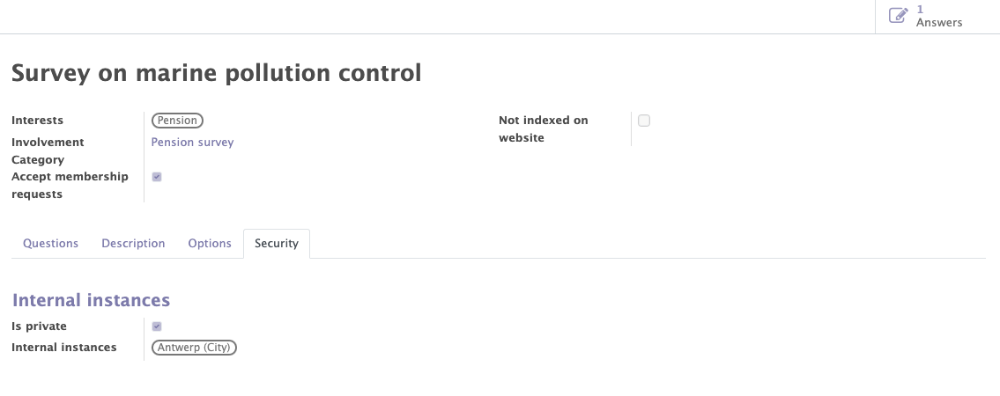

# Surveys

The Mozaik surveys module uses the Odoo standard and adds specific features for political parties and other organizations. It allows you to manage the different events of your organisation.

The Mozaik surveys module differs from the Odoo standard module by several points :

- The recognition of the new partners who have participated to the the survey in order to create a contact form for them.
- The management of the questions of the survey in order to collect reusable data from the attendees.
- The surveys access management in order to limit access to certain people according to the internal instances.

The surveys module uses the Odoo standard and adds specific features for organisations linked to Mozaik. It allows to manage the surveys of the organisation. It will provide access to :

- The general information of the surveys
- The management of the questions
- The recognition of parters
- The access limitations

## General informations of the survey

This functionality allows you to create, modify and manage the surveys related to your organisation.

Various informations can/must be completed on the survey form :

- The standard information of the survey (name, descirption...).
- The interests related to the survey.
- The involvements categories related to the survey.

!!! abstract "The goal of survey management"

    This functionality allows to :

    - Manage the general information of each survey.
    - Add interests to categorise the different survey and to add these interests to the form of the contacts who participated to this survey.
    - Add involvement categories to automatically add them to the form of the contacts who participated to the survey.
    - Get access to the lists of all the answers of the survey.

<figure markdown>

<figcaption>Survey form with general information</figcaption>
</figure>

## The managment of the questions

The different questions of the survey can be added and arranged in the desired order. For each question, it is possible to propose differents types of answers (free text, multiple choices, date...).

!!!info 

    It is possible to add participation categories and interests according to the answers chosen by the participants. 
    <figure markdown>
    
    <figcaption>Adding involvement & interest</figcaption>
    </figure>

!!! abstract "The goal of the questions"

    The questions have differents roles:
    
    - To find out the participant's opinion on the questions asked.
    - To get to know more about the participants in the survey through the interests and then benefit from them in the communications sent to the organisation's contacts 

<figure markdown>

<figcaption>Example of questions for the survey</figcaption>
</figure>

## Recognition of partner

When a person participates to the survey, the module allows to detect, on the basis of several criterias, if the participant already exists in the list of contacts or not. If the latter does not exist, a contact form is created for him. 

!!! abstract "The goal of partner recognition"

    This feature allows you to expand your organisation's list of contacts and then recontact them for other surveys, petitions, events...

## The access limitations

Thanks to the "security" tab, it is possible to limit the visibility and access of each survey to certain people depending on the selected instance. 

!!! example 

    I want that only people from the Antwerp instance can access the survey.

<figure markdown>

<figcaption>Example of an access limitation</figcaption>
</figure>

