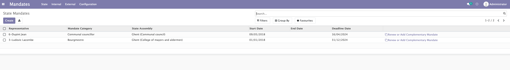

# Mandates
The mandate module allows you to manage all the mandates related to your organisation. Different categories of mandates are possible:

- The states mandates
- The internal mandates 
- The external mandates

These three types of mandates are managed in a similar way. Only the data changes.

Each gatery of mandate give you access to :

- The selection comittee
- The statuts of the mandates
- The invalidation of mandates
- The renewal of mandates

## Selection committee

In order to select a person for a term of office, the first step is to create a selection committee. It is created with the information previously created in the Mozaik structure module (Legislature, designation assembly...).

Once the selection committee is created, you can add a candidate to this committee by choosing the candidate on the new candidate form.

!!!info

    This whole part is an option offered by Mozaik to better track the election of proxies. However, it is possible to directly create a mandate without going through these steps.

<figure markdown>

 <figcaption>Creation of a committee</figcaption>
</figure>

<figure markdown>

 <figcaption>Adding new candidates</figcaption>
</figure>

## Status of the canddiates

Once a new canddiate is declared, he must be nominated then elected to create a new mandate. 

<figure markdown>

 <figcaption>Management of the status of the candidates</figcaption>
</figure>

## Invalidation of mandates

The mandates are characterized by three dates: beginning of mandates, end and expiration. It is possible to invalidate the mandate, end it:

- Automatically on the expiry date
- Manually by setting an end date before the expiration date

## Renewal of mandates

It is not possible to create two same mandates at the same time for the same person. However it is possible to create another mandate for the same person, same assembly, same period but another position.

!!!example

    Create a mandate of vice-Chairman in addition of a mandate of director

It is also possible to renew for the same person of an expired mandate; starting date will be positioned the day after the expiry date → no need for an application in this case. In the mandate form it is possible to add an alert delay in number of months. This allows you to be notified when a mandate is about to expire.

??? tip

    It is possible to create and retrieve all categories of mandates for political mandates - internal and external by clicking on "configurations" then "categories of mandates"

