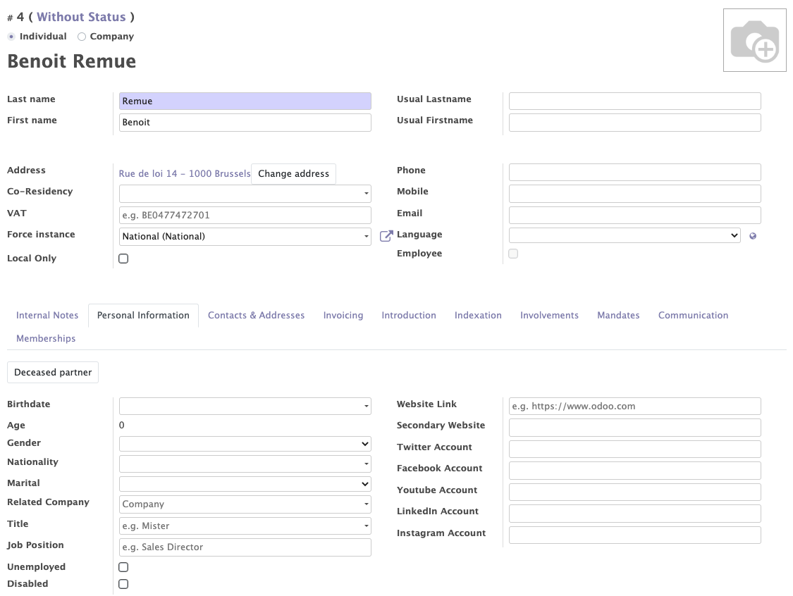
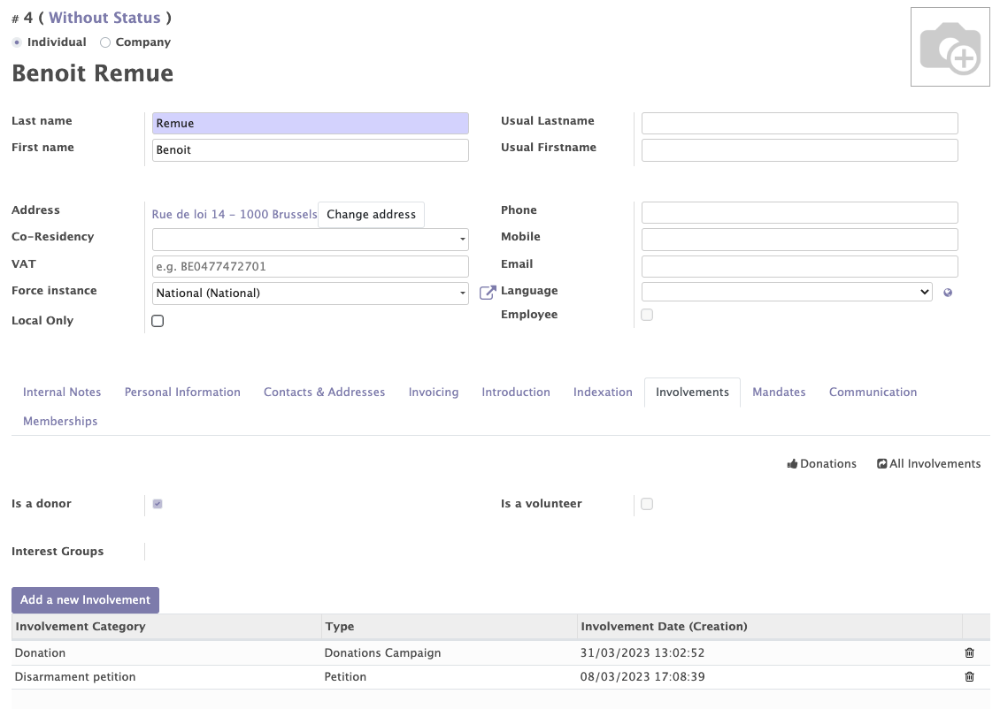
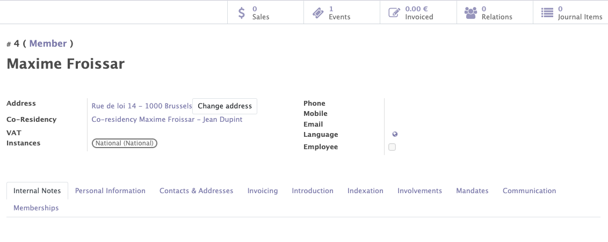
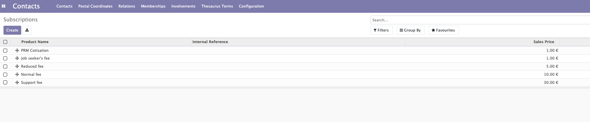

# Contacts Module

The contact module - which is a central module in Mozaïk - allows to manage all the contacts related to your organisation / political party.  It will give you access to:

- All the general information about each contact (members, supporters, all other contacts)
- The interests & competencies of each contact
- The participations of each member (interactions with the organisation)
- The management of duplicates and co-residencies
- Membership lines
- Membership fees
- Membership states
- Membership renewals

## Contacts: People management (physical or corporate)

This functionality allows you to create, modify and manage all the contacts (members/subscribers/other contacts) related to your organisation.

Various informations can be collected for each contact (companies or individuals): 

- The standard information of a contact : name, first name, phone, address...
- Some personal information: age, gender, disability, social networks... 

!!! info "Address"

    The encoding of addresses on the contact form is facilitated by the auto-completion fonctionnality that the system provides. This fonctionnality allows you to choose the city and the street from a list of predefined choices. This system allows to avoid encoding errors and helps detect duplicates. 

    :warning: Depending on their address, the contacts are associated with a local group/instance of the organisation. When the address changes, the instance of the contact can also be updated.
    !!! example
    
        A contact whose address is located in Brussels will belong to the Brussels local group of the organisation. If a member moves from Brussels to Antwerp, this member will now be related to the local group linked to the city of Antwerp.

!!! abstract "The goal of people management"

    This feature allows you : 

    - To manage all the information about your contacts
    - To get to know your members and supporters better
    - To use personal information of your members for membership purposes (membership fee)

<figure markdown>
  
  <figcaption>Contact form with general and personal information </figcaption>
</figure>

<figure markdown>

<figcaption>Creation of an address with the auto-completion function</figcaption>
</figure>

## Indexation

Contacts (members, supporters, other contacts) can be linked to interests and competencies. Those interests and competencies are chosen from a list of terms, called Thesaurus terms in Mozaïk and can be adapted according to the needs of each organisation.

!!! abstract "The goal of Thesaurus terms" 
    
    Those interests and competencies are present for information purposes (to better know your members and supporters), but also to achieve specific targeting with the communication tools / mass mailings.
    !!! example

        I would like to send a newsletter around 'Nuclear energy' to all members who are interested by this topic. 
        
        More informations about how to target contacts based on those informations in the chapter about the <a href="https://mozaik-association.github.io/mozaik/Distribution-list-module/" target="_blank">distribution list module</a>.

Interests and competencies can:

- Be added manually by contacts during their registration.

!!! example

    I am interested by the themes of 'nuclear energy' and 'human right'

- Automatically when a member registers for a specific event / survey or petition 

!!!example

    If the petition that is signed by a member concerns 'nuclear energy', the related 'Thesaurus term' can automatically be added as 'Interest' for this member.

<figure markdown>

<figcaption>Example of a contact form with Thesaurus terms</figcaption>
</figure>

## Involvements

This functionality enables you to add all the interactions between your organisation and its members / supporters. The types of interactions can be defined by each organisation according to their needs (signature of a petition, participation to a volontary action...)

!!!abstract "Goal of the involvements"

    Involvements allow you to get to know your contacts better / categorize them / keep track of all interactions with a particular contact over the years. These entries can be used to send mailings to your contacts in a very targeted manner.
    !!!example
        A member made a donation on 31/03/2023 and signed a petition about disarmement one week later. These participations will appear on his contact form and can be used in future mailings (send an email to all donors who have signed a petition in the last 2 months)
How to add them :

- An involvement can be added manually on a contact page.
- An involvement can be added automatically through a membership form.
- An involvement can be added automatically through the signature of a petition, the completion of a survey or the participation to an event.

<figure markdown>

<figcaption>Example of a contact form with participations</figcaption>
</figure>

## Duplicates

A very elaborated duplicate check system based on :

- Name
- Phone
- Mobile
- Email 
- Address

Helps you identify, manage and merge possible duplicates within your contacts database. 

!!! info

    When a duplicate is detected, a button “show all duplicates” appears on the contact form of the duplicate members. This button allows to display the list of contacts with one or more identical fields.
    <figure markdown>
    
    <figcaption>Appearance of the button "Show all duplicates"</figcaption>
    </figure>

## Co-residencies

When two or more people share the same address, they can be grouped into a co-residency. This idicates that those people are no duplicates but simply share the same adress.

Co-residencies allow you to :

- Avoid duplicates within your contacts database.
- Link people from the same family to each other.
- Avoid sending 2 letters to the same address.

??? question "How to create a co-residency ?" 

    You can create a co-residency by clicking on "action"--> "create a co-residency address” and entering the name of the co-residents in "line 1 and 2" 
    <figure markdown>        
    
    <figcaption>Creation of a co-residency</figcaption>
    </figure>

!!! info

     Once you have created a co-residency or allowed the duplicates, the "show all duplicates" button will disappear.

<figure markdown>

<figcaption>Example of a contact with a co-residency</figcaption>
</figure>

## Membership lines

A membership can be created by selecting an instance and a status for the member and the start date.  Once the membership is added, it is possible to update the status of the member and to see the evolution of the status over the time. A member can also be fired or can leave the organisation. To reinstate a member into the organisation, a new membership is required for that member. 

Each member in odoo is linked to a unique member number. The member number can be found on the contact form.

!!! abstract "The goal of memberships lines"

    Membership lines allow you to track the membership status of each contact as well as membership dates. Thanks to the membership lines you are able to see the type of membership the contact has and whether or not the membership has been paid for by the contact. Finally, the membership lines allow you to see the internal instance related to the membership.

<figure markdown>

<figcaption>New adhesion line on the contact form + unique member number</figcaption>
</figure>

## Membership fees

Each organisation can choose its own membership prices depending on the individual's situation.  When creating a membership, the type of membership and therefore the price will be adapted to the individual.

!!! abstract "The goal of memberships fees"

        The purpose of this feature is to be able to assign a membership type and a price according to selected rules.
        !!! example

            The price of a normal membership is 10€ and the price of a membership for people with disabilities is 5€. Contacts who are in a disability situation will benefit from the 5€ membership.

            If the contact does not meet any of the special conditions, then the normal rate applies. Hence the importance of filling in the contact information correctly.

<figure markdown>

<figcaption>Creation of different types of subscriptions</figcaption>
</figure>

## Membership Statuses

Each contact is linked to a status and each organisation can have its own membership status. Members of the organisation will move from one status to another over time according to certain rules. The different statuses depend on a workflow that can be set up according to the needs of each organisation.

<figure markdown>

<figcaption>Example of the different membership statuses of an organisation</figcaption>
</figure>

<figure markdown>

<figcaption>Workflow of the differents statuses of the organisation</figcaption>
</figure>

## Membership renewals
Each year a call for membership renewal is send by the organisation. This is done by generating a mass structural communication and sending a personalised letter with the explanation of the amount, the structured communication to be used.

In the middle of the year, by using the "mass closure" button, we can cancel all the unpaid invoices by the contacts and automatically change their status to "old".

!!!info

    As with the statuses, each organisation can have its own membership renewal workflow.

<figure markdown>

<figcaption>Example of a membership renewal workflow</figcaption>
</figure>
