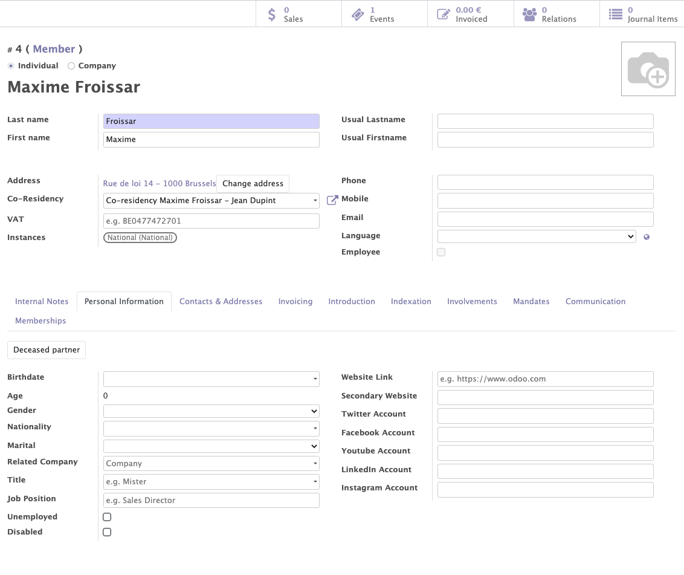
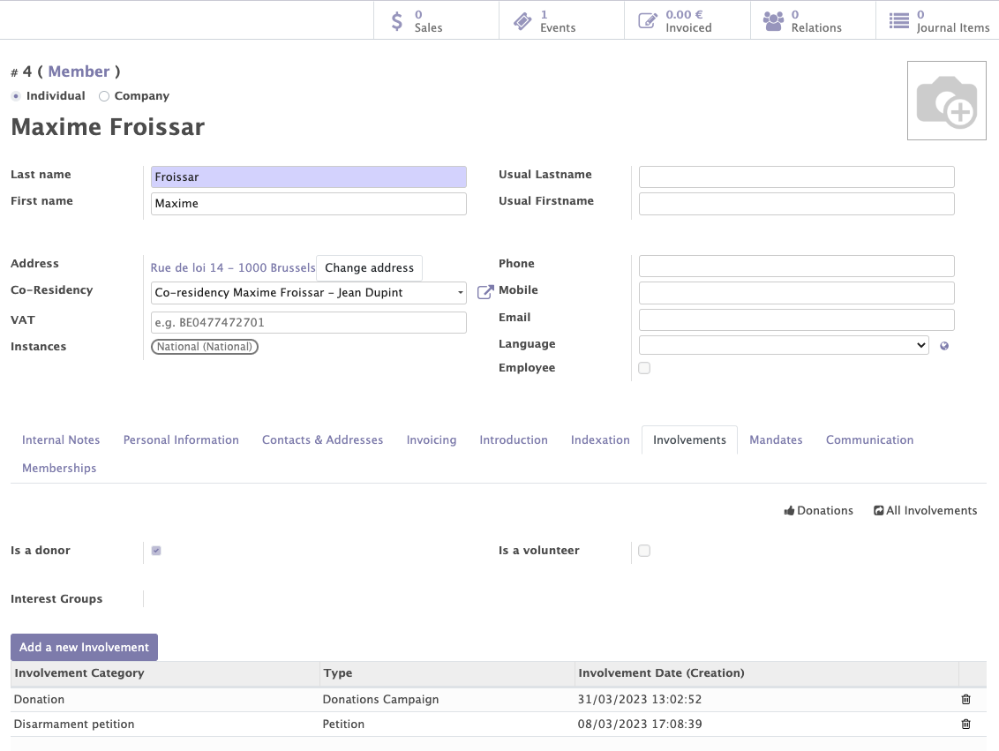

# Contacts Module

The contact module - which is a central module in Mozaïk - allows to manage all the contacts related to your organisation / political party.  It will give you access to:

- All the general information about each contact (members, supporters, all other contacts)
- The interests & competencies of each contact
- The participations of each member (interactions with the organisation)
- The management of duplicates and co-residencies
- Membership lines
- Membership fees
- Membership states
- Membership renewals

## Contacts: People management (physical or corporate)

This functionality allows you to create, modify and manage all the contacts (members/subscribers/other contacts) related to your organisation.

Various informations can be collected for each contact (companies or individuals): 

- The standard information of a contact : name, first name, phone, address...
- Some personal information: age, gender, disability, social networks... 

!!! info "Address"

    The encoding of addresses on the contact form is facilitated by the auto-completion fonctionnality that the system provides. This fonctionnality allows you to choose the city and the street from a list of predefined choices. This system allows to avoid encoding errors and helps detect duplicates. 

    :warning:Depending on their address, the contacts are associated with a local group/instance of the organisation. When the address changes, the instance of the contact can also be updated.
    !!! example
    
        A contact whose address is located in Brussels will belong to the Brussels local group of the organisation. If a member moves from Brussels to Antwerp, this member will now be related to the local group linked to the city of Antwerp.

!!! abstract "The goal of people management"

    This feature allows you : 

    - To manage all the information about your contacts.
    - To get to know your members and supporters better.
    - To use personal information of your members for membership purposes (membership fee).

<figure markdown>
  
  <figcaption>Contact form with general and personal information </figcaption>
</figure>

<figure markdown>

<figcaption>Creation of an address with the auto-completion function</figcaption>
</figure>

## Indexation

Contacts (members, supporters, other contacts) can be linked to interests and competencies. Those interests and competencies are chosen from a list of terms, called Thesaurus terms in Mozaïk and can be adapted according to the needs of each organisation.

!!! abstract "The goal of Thesaurus terms" 
    
    Those interests and competencies are present for information purposes (to better know your members and supporters), but also to achieve specific targeting with the communication tools / mass mailings.
    !!! example

        I would like to send a newsletter around 'Nuclear energy' to all members who are interested by this topic. 
        
        More informations about how to target contacts based on those informations in the chapter about the <a href="https://mozaik-association.github.io/mozaik/Distribution-list-module/" target="_blank">distribution list module</a>.

Interests and competencies can:

- Be added manually by contacts during their registration.

!!! example

    I am interested by the themes of 'nuclear energy' and 'human right'

- Automatically when a member registers for a specific event / survey or petition 

!!!example

    If the petition that is signed by a member concerns 'nuclear energy', the related 'Thesaurus term' can automatically be added as 'Interest' for this member.

<figure markdown>

<figcaption>Example of a contact form with Thesaurus terms</figcaption>
</figure>

## Involvements

This functionality enables you to add all the interactions between your organisation and its members / supporters. The types of interactions can be defined by each organisation according to their needs (signature of a petition, participation to a volontary action...)

!!!abstract "Goal of the involvements"

    Involvements allow you to get to know your contacts better / categorize them / keep track of all interactions with a particular contact over the years. These entries can be used to send mailings to your contacts in a very targeted manner.
    !!!example
        A member made a donation on 31/03/2023 and signed a petition about disarmement one week later. These participations will appear on his contact form and can be used in future mailings (send an email to all donors who have signed a petition in the last 2 months)
How to add them :

- An involvement can be added manually on a contact page.
- An involvement can be added automatically through a membership form.
- An involvement can be added automatically through the signature of a petition, the completion of a survey or the participation to an event.

<figure markdown>

<figcaption>Example of a contact form with participations</figcaption>
</figure>

## Duplicates

A very elaborated duplicate check system has been implemented. It is based on :

- Name
- Phone
- Mobile
- Email 
- Address

It Helps you identify, manage and merge possible duplicates within your contacts database. 

!!! info

    When a duplicate is detected, a button “show all duplicates” appears on the contact form of the duplicate members. This button allows to display the list of contacts with one or more identical fields.
    <figure markdown>
    
    <figcaption>Appearance of the button "Show all duplicates"</figcaption>
    </figure>

## Co-residencies

When two or more people share the same address, they can be grouped into a co-residency. This idicates that those people are no duplicates but simply live in the same acomodation.

Co-residencies allow you to :

- Avoid duplicates within your contacts database.
- Link people from the same family to each other.
- Avoid sending 2 letters to the same address.

??? question "How to create a co-residency ?" 

    You can create a co-residency by selecting your contacts, clicking on "action"--> "create a co-residency address” and entering the name of the co-residents in "line 1 and 2" 
    <figure markdown>        
    
    <figcaption>Creation of a co-residency</figcaption>
    </figure>

!!! info

    Once you have created a co-residency or allowed the duplicates, the "show all duplicates" button will disappear.

<figure markdown>

<figcaption>Example of a contact with a co-residency</figcaption>
</figure>

## Memberships
It is possible to track the membership history of a member from the memberships tab of a contact. In this tab, you can find a whole list of information:

- Internal instance to which the member is linked his through membership.
- Membership status to which the contact belongs (former member, new member...).
- Type of membership fee paid (normal membership, reduce price (job seeker, disabled)).
- Price of the subscription.
- Structured communication reference (possible to work with a structured communication).
- Payement link (possible to pay the membership online with Stripe...)
- Member in good standing or not (modifier)
- Start and end date of the membership.

This tab allows you to easily manage or modify memberships. 

Mozaik allows you to manage the membership cards of the organisation, to see who has already received his card and who has yet to receive it.
 
Each member in Odoo is linked to a unique member number. The member number can be found on the contact form next to the contacts name and the membership state.

!!! abstract "The goal of membership lines"

    Membership lines allow you to track the membership status of each contact as well as membership dates. You can easilly do some reporting by organising your members by membership states , local groups, type of memberships (prices), dates ,...
<figure markdown>

<figcaption>New memberhsip line on the contact form & unique member number</figcaption>
</figure>

## Membership fees
Several membership types can be added in Mozaik. Each organisation can define its own membership types and link each type to a specific price and rule. Members will have to pay a certain price according to these rules.

!!! example

    1. It is possible to set a lower price for the first year of membership compared to subsequent years.
    2. It is possible to put a different price for people with disabilities (example: 5€ instead of 10€)

!!! abstract "The goal of memberships fees"

    The purpose of this feature is to allow prices and membership types to be adapted to the specificities of the organisation's contacts.
        

<figure markdown>

<figcaption>Creation of different types of subscriptions</figcaption>
</figure>

## Membership Statuses

A complete membership workflow has been implemented in Mozaik. Members are linked to a membership status that evolves over time according to certain rules.
!!! info

    This workflow can easily be adapted if it does not meet the exact needs of the organisation.

<figure markdown>

<figcaption>Example of the different membership statuses of an organisation</figcaption>
</figure>
!!! example "Example of workflow"

    - A member who resigns changes from a "member" to a "resignation former member".
    - A member who declines to pay the membership fee will be given the status "former member".
<figure markdown>

<figcaption>Mozaik membership workflow</figcaption>
</figure>

## Membership renewals
Each year, the organisation may issue a call for membership renewal. Members who did not pay the previous year become " former members ".

Members in good standing will receive:

- An email with link to pay online. 
- A letter with a structured communication to pay.

!!!info

    It is possible to change the status of all members who have not paid their membership fee before the deadline to "former member fee".
<figure markdown>

<figcaption>Example of a membership renewal workflow</figcaption>
</figure>