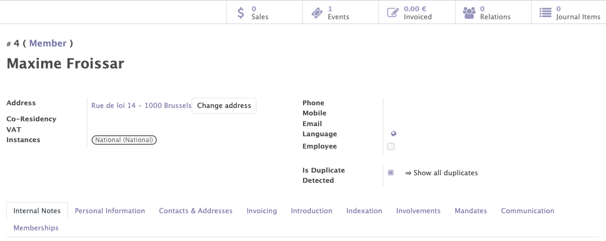
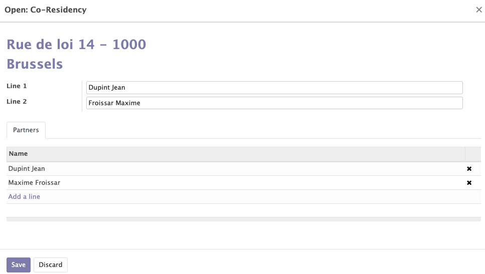

# Contacts Module

## Contacts: people management (physiscal or corporate)

This module allows you to create and modify contacts using the personal information of the members/subscribers of the political party.
Various information is collected when a contact of a physical and moral person is registered. The usual personal information name, first name, date of birth, age, phones, address.

- Two names pssible for one person (official and cusomary) only for a physical person. The customary name can be useful to name a contact by a name (other than his official name) that he is used to being called 
- A name and an acronym possible only for a moral person.
- Adresse Format : postal code + street. For each country it is possible to choose if, when registering a new contact on the site or directly in the backend, the postal code and city should be selected from a list stored in the application or if this information should be entered manually. The selection of the postal code and city from a stored list allows to facilitate the choice of the address thanks to the autocompletion, to reduce the errors of address and to avoid the duplicates for the co-residences. If two people live under the same address, they can be put in co-residence (details of co-residence will be explained later). If the addresses are not exactly the same, the system will not detect duplicates. That's why the postal code and city list system is interesting. The reference street can also be chosen from a list of streets stored in the application. A street 2 is also available for streets with a long name, streets with a translation in another language. 

According to their address, each contact belonging to a political party is associated with a local group/instance. For example, a contact whose address is located in Huy will belong to the Huy local group if the address of a party member is changed, a function can be selected to automatically change the local group member. Example: a member moves from Brussels to Namur. Then his local group will change from Brussels to Namur. it is possible to force the choice of the instance. More details in the explanation of the <a href="https://mozaik-association.github.io/mozaik/Structure%20Module/" target="_blank">structure module</a>.  

- A "global opt-out" box can be checked on a member's form to be blacklisted from receiving mass communications from the party (emailing campaign). However, the contact will still receive the usual emails
- The current professional and health situation (disabled or not) is also requested. This two pieces of information are important because they can change the price of the membership fee for the member → if desired by the party.
- The different social networks of the contact can also be registered.

## Co-résidences

A duplicate check system based on name, phone, mobile, email and address detect possible duplicate contacts. When a duplicate contact is detected, a button “doublon détecté” appears on the card of the duplicate members, allowing to display the contact(s) with one or more identical fields. Duplicate contacts appear in yellow in the contacts list. Once detected you can  allow duplicates for name - email - mobile – phone – address by clicking on "action".

???+ tip

    To allow duplicates click on the "action" button at the top of the contact form then click on authorize + "name of the authorisation"

When two people have the same address, the system detects a duplicate (screenshot above). Once detected we have the possibility to create a co-chair between these two people by selecting the members you wish to co-reside (screenshot 1), by clicking on "action"--> "create a co-residence address” and entering the name of the co-residents in "line 1 and 2" (screenshot 2). It is also possible to add a contact directly to an existing co-presidency in the contact form. The co-chair system will avoid duplicates in the list of contacts and will also avoid sending several letters to several contacts with the same address. It is also possible to do the same thing with two people having the same email address. 

## Autorizations

A member working for the political party can be designated as a user. He is given an ID, a role and an internal instance. Depending on his role and internal instance the user will be granted access to certain functionalities in Odoo. For example, a user who is part of the national committee will have access to all contacts. A user who was part of a local committee will only have access to the contacts of his local group.

!!! info inline left "information"

    to turn a contact into a user, clikc on the "action" button then click on "transform into user"

## Indexation

Contacts (members, supporters, other contacts) can be linked to interests and competencies. Those interests and competencies are chosen from a list of terms (called Thesaurus terms in Odoo (screenshot) that can be completed / adapted for each political party. 

Interests and competencies can:
- Be added manually by contacts during their registration (ex: I am interested by the themes of 'nuclear energy' and 'sports')
- Automatically when a member registers for a specific event / survey or petition (if the petition that is signed by a member concerns 'nuclear energy', the related 'Thesaurus term' can be added as 'Interests' for this member manually by the backoffice of the political party
- Those interests and competencies are present for information purposes, but also to achieve specific targeting with the communication / mass mailings (ex: I would like to send a newsletter around 'Nuclear energy' to all members who are interested by this topic. More informations about how to target contacts based on those informations in the chapter about the <a href="https://mozaik-association.github.io/mozaik/Distribution-list-module/" target="_blank">distribution list module</a>.

## Participations

It is possible to identify and add on the contact form the interactions between the political party and the member. We can for example see if a member participated in an event, a donation, a petition of the political party. Participation allows you to pull and search for the mailing.
A participation can be added via a membership form created by the party, via the signature of a petition or a donation, or manually directly on the contact page of the contact.
Possible to find all the participations of all the contacts for each event in the tab"participations" --> "participations". 
Possible to find all the events in tab "participations" → "catégories des participations".

## internal notes/introduction

Possibility to add a free text in the "notes internes" tab of a member's file
Possibility to add an introduction of the member with a free text on its card by clicking on the tab "introduction".

## Communication

The system uses an algorithm to check which people are not receiving emails sent from Odoo. After a certain number of bugs counted for a member (depending on your choice), the member is blacklisted from the mailing list so that he/she does not continue to send mails to people who do not receive them. failed emails.

The same goes for letters sent to the home address that come back. For maiing, failures are entered manually in the member's record in Odoo "failed letters".

## Membership 

A membership can be created by selecting an instance and a statuts for the member and the start date.  Once the membership is added, it is possible to update the status of the member and to see the evolution of the status over the time. A member can also be fired or can leave. To reinstate a member, a new membership is required for that member.

## Member Statuts

The member system depends on each company/party. There are several generic statuses through which contacts will pass depending on certain cases:

!!! info inline end "information"

    Sub points are the reasons why a contact can go through this status

- No statut
- Candidat member
    * Validation of a membership application (first membership):
    * New member  
    * Sympathizer who applies for membership 
    * Rejected person applying for membership
- Candidate member refused
    * applicatoin rejected
- Commission (futur) members
    * Dues paid by a person who has never been a member before
- Member : pay a fee and has the right to vote, has a greater importance, participates mare in the life of the party.
    * Dues paid (renewal)
- Sympathizer : does not pay a fee but has no right to vote. He can still participate in events.
    * Application for membership as a supporter
    * Membership application not paid in time
    * Membership refused by the membership comittee but accepeted as a supporter
- Old sympathizer
    * Sympathizer who knows disinterest
- Previous member
    * Renewal of unpais dues
    * Exclusion
    * innoportune : exlcusion of a member (membership fee)
    * Resignation : member shows disinterest
    * In breacj : disinterest of a former member (membership fee)
- Commission (Alumni) member
    * Former member who pays dues
Noted that additional status specific to the needs of each party can be added as needed and through wich the contact will pass. 

__Workflow of an adhésion :__

__Workflow of a first contribution for a member:__

When reapplying for membership, the officer will check:
 - Contact informations
 - Does the person aldready exist or not ?
 - Linking of interrests with thesaurus

 ## Cotisation and amout of the fee

 As far as dues rates are concerned, these are simple Odoo items. Membership rates vary based on several rules:
- First membership 
- With a disability 
- Unemployed 
- Parent teacher
- Contact over 63 years old 
- If the contact does not meet any of these rules, then the normal rate applies. Hence the importance of completing the information in the contact form 
!!! info

    Each Political party can have its own rule

## Membership renewal 
Mass renewal of subscriptions for the following year. Mass generation of structured communication. Sending of a personalized letter (explanation of amounts, payment slips, structured communication). Receipt of payments. Using the "mass closure" button → Mass cancellation of unpaid invoices (automatic switch to "old" status).

__Membership renewal workflow :__
