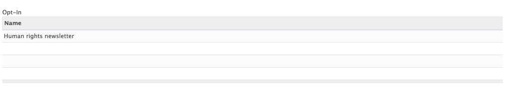
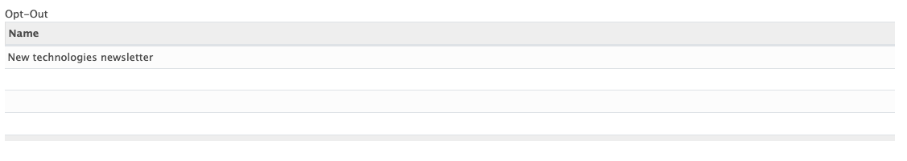
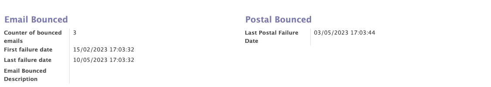
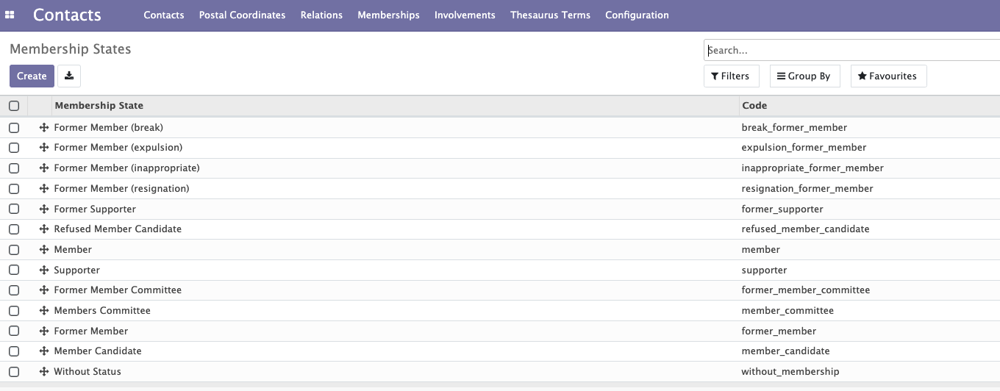

# Contacts Module

The contact module - which is a central module in Mozaïk - allows to manage all the contacts related to your organization / political party.  It will give you access to:

- All the general information about each contact (members, supporters, all other contacts)
- Memberships lines
- Membership fees
- Membership renewals
- Membership states
- The interests & competencies of each contact
- The participations of each member (interactions with the organization)
- The management of the adresses & co-residencies
- Communication preferences (opt in / opt out)

## Contacts: People management (physical or corporate)

This functionality allows you to create, modify and manage all the contacts (members/subscribers/other contacts) related to your organization.

Various informations can be collected for each contact (companies or individuals). 

- The standad information of a contact : name, first name, phone, address...
- Some personal information: age, gender, disability, social networks... 

!!! info "Address"

    The encoding of addresses on the contact form is facilitated by the auto-completion fonctionnality that the system provides. This fonctionnality allows you to choose the city and the street from a list of predefined choices. This system allows to avoid encoding errors and helps detect duplicates. 

    Depending on their address, the contacts are associated with a local group/instance. When the address changes, the instance of the contact can also be updated. (expliquer instance/local group en 2 mots)
    !!! example
    
        A contact whose address is located in Brussels will belong to the Brussels local group of the organization. If a member moves from Brussels to Antwerp, this member will now be related to the local group linked to the city of Antwerp.

!!! abstract "The goal of people managment"

    This feature allows you : 

    - To manage all the information about your contacts
    - Information can be used for the adhesions

<figure markdown>
  
  <figcaption>Contact form with general and personal information </figcaption>
</figure>

<figure markdown>

<figcaption>Creation of an address with the auto-completion function</figcaption>
</figure>

## Co-résidences

A duplicate check system based on the name, phone, mobile, email and address detect possible duplicate contacts. When a duplicate is detected, a button “show all duplicates” appears on the contact form of the duplicate members. This button allows to display the list of contacts with one or more identical fields.

!!! abstract "The goal of co-résidences"

    This fonctionnality allows you to manage duplicate contacts. Once a duplicate is detected you have two possibilities:

    - You can create a co-residence  between these two people by selecting the members you wish to co-reside . It is also possible to add a contact directly to an existing co-residence in the contact form. The co-residence system will avoid duplicates in the list of contacts and will also avoid sending several letters to several contacts with the same address. This fonctionnality works also if two people have the same email address.

    ??? question "How to create a co-residence ?" 

        You can create a co-residence by clicking on "action"--> "create a co-residence address” and entering the name of the co-residents in "line 1 and 2" 
        
    
    - You can  allow duplicates for name - email - mobile – phone – address.
    ??? question "How to allow duplicates ?"

        To allow duplicates click on the "action" button at the top of the contact form then click on authorize + "name of the authorisation"
    !!! info

        Once you have created a co-résidence or allowed the duplicates, the "show all duplicates" button will disappear.

<figure markdown>

<figcaption>appearance of the button "show all duplicates"</figcaption>
</figure>
<figure markdown>

<figcaption>list that appears when you click on "show all duplicates"</figcaption>
</figure>

## Access Rules

Thanks to this fonctionnality you can transform a contact who is working for the organization into a user of Mozaik. He is given an login, a role and an internal instance. 

!!! abstract "The goal of access rules"

    This feature allows you to give different access to your user contacts in Mozaik depending on the internal instance they receive when they are transformed into a user
    !!! example
    
        A user who is part of the national committee will have access to all contacts. A user who was part of a local committee will only have access to the contacts of his local group

??? question "How to transform a contact into a user ?"

    To turn a contact into a user, click on the "action" button then click on "transform into user"

<figure markdown>

<figcaption>Transformation of a contact into a user</figcaption>
</figure>

<figure markdown>

<figcaption>Information of a contact user on the contact form</figcaption>
</figure>

## Indexation

Contacts (members, supporters, other contacts) can be linked to interests and competencies. Those interests and competencies are chosen from a list of terms, called Thesaurus terms in Mozaïk and can be adapted according to the needs of each organisation.

!!! abstract "The goal of Thesaurus terms" 
    
    Those interests and competencies are present for information purposes (to better know your members and supporters), but also to achieve specific targeting with the communication tools / mass mailings.
    !!! example

        I would like to send a newsletter around 'Nuclear energy' to all members who are interested by this topic. 
        ???question "How to target specific contacts ?"

            More informations about how to target contacts based on those informations in the chapter about the <a href="https://mozaik-association.github.io/mozaik/Distribution-list-module/" target="_blank">distribution list module</a>.

Interests and competencies can:

- Be added manually by contacts during their registration.

!!! example

    I am interested by the themes of 'nuclear energy' and 'sports'

- Automatically when a member registers for a specific event / survey or petition 

!!!example

    If the petition that is signed by a member concerns 'nuclear energy', the related 'Thesaurus term' can automatically be added as 'Interest' for this member.

<figure markdown>

<figcaption>Example of a contact form with Thesaurus terms</figcaption>
</figure>

## Involvements

This functionality enables you to add all the interactions between your organization and its members / supporters. The types of interactions can be defined by each organization according to their needs (signature of a petition, participation to a volontary action...)

!!!abstract "Goal of the involvements"

    Involvements allow you to get to know your contacts better / categorize them / keep track of all interactions with a particular contact over the years. These entries can be used to send mailings to your contacts in a verry targeted manner.
    !!!example
        A member made a donation on 31/03/2023 and signed a petition about 'ce thème' one week later. This participations will appear on his contacts form and can be used in future mailings (send an email to all donors who have signed a petition in the last 2 months)
How to add them :

- An involvement can be added manually on a contact page 
- An involvement can be added automatically through a membership form.
- An involvement can be added automatically through the signature of a petition, the completion of a survey or the participatin to an event

<figure markdown>

<figcaption>Example of a contact form with a participation</figcaption>
</figure>

## Communication preferences

This tab allows you to manage the communication preferences of all contacts in the organisation. It also allows you to handle communication breakdowns with contacts thanks to an algorithm that detects people who do not receive communication from the organisation (emails and post).

!!! abstract "The goal of communication preferences"

    Thanks to this fonctionnality, contacts can explicitly state that they wish to receive particular newsletters or that they do not wish to receive specific newsletters at all.
    !!! example

        - This contact reported that he explicitly wishes to receive the human rights newsletter
        

        - This contact reported that he does not wish to receive any newsletter concerning new technologies
        
    
    This fonctionnality also allows you to see the number of emails or mails that have not been received by a contact.
    !!! example

        The system recorded 3 emails returned for this contact
        
        ???tip

            It is then possible to blacklist all contacts with X emails or postal bounced

## Memberships lines

A membership can be created by selecting an instance and a statuts for the member and the start date.  Once the membership is added, it is possible to update the status of the member and to see the evolution of the status over the time. A member can also be fired or can leave. To reinstate a member, a new membership is required for that member.

!!! abstract "The goal of memberships lines"

    The membership lines allow to follow the evolution of the membership status of each contact as well as their membership dates. The membership lines also allow you to see what type of membership the contact has and whether the membership has been paid for or not by the contact.

<figure markdown>

<figcaption>Creation of an adhesion</figcaption>
</figure>

<figure markdown>

<figcaption>New adhesion line on the contact form</figcaption>
</figure>

## Memberships fees

Each organisation can choose its own membership rates depending on the individual's situation.  When creating a membership, the type of membership and therefore the price will be adapted to the individual.

!!! abstract "The goal of memberships fees"

        The purpose of this feature is to be able to assign a membership type and a price according to selected rules
        !!! example

            The price of a normal membership is 10€ and the price of a membership for people with disabilities is 5€. Contacts who are in a disability situation will benefit from the 5€ membership.

<figure markdown>

<figcaption>Creation of different types of subscriptions</figcaption>
</figure>

## Member Statuts

The member system depends on each company/party. There are several generic statuses through which contacts will pass depending on certain cases:

!!! info inline end "information"

    Sub points are the reasons why a contact can go through this status

- No statut
- Candidat member
    * Validation of a membership application (first membership):
    * New member  
    * Sympathizer who applies for membership 
    * Rejected person applying for membership
- Candidate member refused
    * application rejected
- Commission (futur) members
    * Dues paid by a person who has never been a member before
- Member : pay a fee and has the right to vote, has a greater importance, participates mare in the life of the party.
    * Dues paid (renewal)
- Sympathizer : does not pay a fee but has no right to vote. He can still participate in events.
    * Application for membership as a supporter
    * Membership application not paid in time
    * Membership refused by the membership comittee but accepeted as a supporter
- Old sympathizer
    * Sympathizer who knows disinterest
- Previous member
    * Renewal of unpais dues
    * Exclusion
    * Innoportune : exlcusion of a member (membership fee)
    * Resignation : member shows disinterest
    * In breacj : disinterest of a former member (membership fee)
- Commission (Alumni) member
    * Former member who pays dues
    
Noted that additional status specific to the needs of each party can be added as needed and through wich the contact will pass. 

__Workflow of an adhésion :__

__Workflow of a first contribution for a member:__

When reapplying for membership, the officer will check:

 - Contact informations
 - Does the person aldready exist or not ?
 - Linking of interrests with thesaurus

## Cotisation and amout of the fee

 As far as dues rates are concerned, these are simple Odoo items. Membership rates vary based on several rules:

- First membership 
- With a disability 
- Unemployed 
- Parent teacher
- Contact over 63 years old 
- If the contact does not meet any of these rules, then the normal rate applies. Hence the importance of completing the information in the contact form 

!!! note "information"

    Each political party can have its own rule

## Membership renewal 
Mass renewal of subscriptions for the following year. Mass generation of structured communication. Sending of a personalized letter (explanation of amounts, payment slips, structured communication). Receipt of payments. Using the "mass closure" button → Mass cancellation of unpaid invoices (automatic switch to "old" status).

__Membership renewal workflow :__
