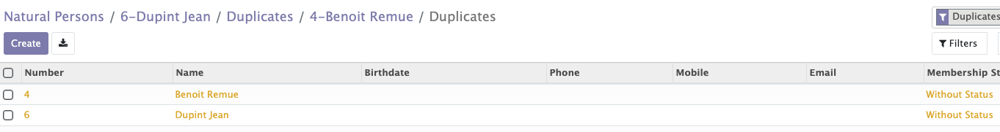
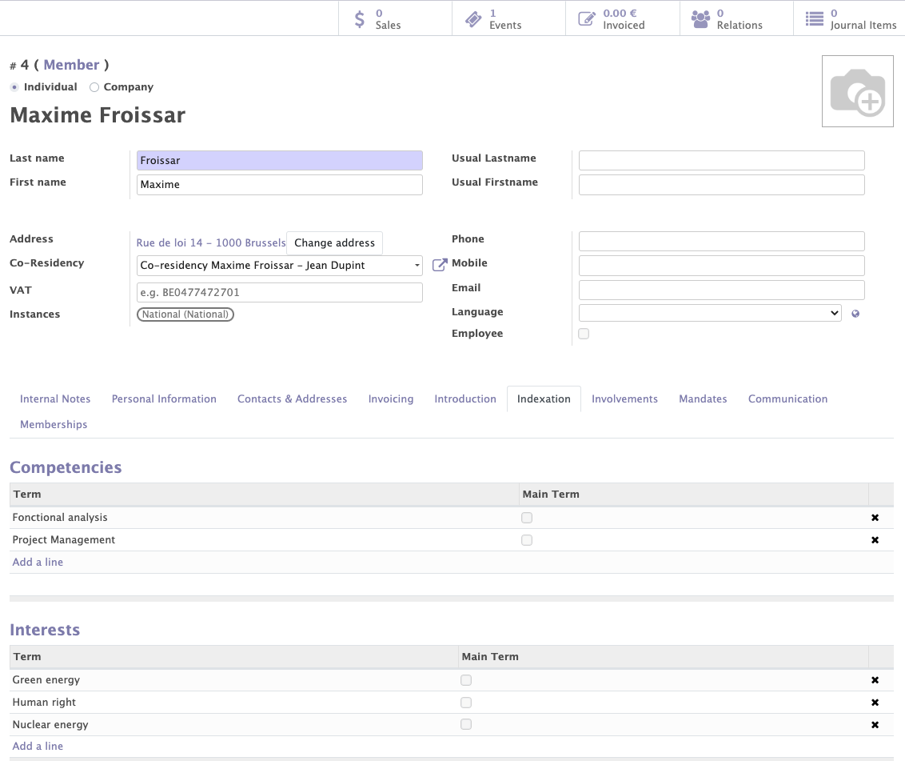

# Contacts Module

The contact module - which is a central module in Mozaïk - allows to manage all the contacts related to your organization / political party.  It will give you access to:

- All the general information about each contact (members, supporters, all other contacts)
- Memberships lines
- Membership fees
- Membership renewals
- The interests & competencies of each contact
- The participations of each member (interactions with the organization)
- The management of the adresses & co-residencies
- Communication preferences (opt in / opt out)

## Contacts: People management (physical or corporate)

This functionality allows you to create and modify contacts using the personal informations of the members/subscribers of the political party.
Various informations are collected when a contact of a physical and moral person is registered. The usualinformations name, first name, phones, address and some personal information as the age, the gender, the healt situation, the social networks. 

!!! abstract "Adresse"

    The encoding of addresses on the contact form is facilitated by the auto-completion system that the system provides. this system allows you to choose the city and the street from a list of predefined choices. This system allows to avoid encoding errors and also to detect duplicates. 
    Depending on their address, the organisation's contacts are associated with a local group/instance. When the address changes, the instance of the contact will also change.
    !!! example
    
        A contact whose address is located in Huy will belong to the Huy local group if the address of a party member is changed, a function can be selected to automatically change the local group member. If a member moves from Brussels to Namur. Then his local group will change from Brussels to Namur.
        

## Co-résidences

A duplicate check system based on name, phone, mobile, email and address detect possible duplicate contacts. When a duplicate contact is detected, a button “doublon détecté” appears on the card of the duplicate members, allowing to display the contact(s) with one or more identical fields. Duplicate contacts appear in yellow in the contacts list. Once detected you can  allow duplicates for name - email - mobile – phone – address.

??? tip

    To allow duplicates click on the "action" button at the top of the contact form then click on authorize + "name of the authorisation"

When two people have the same address, the system detects a duplicate (screenshot above). Once detected we have the possibility to create a co-chair between these two people by selecting the members you wish to co-reside . It is also possible to add a contact directly to an existing co-presidency in the contact form. The co-chair system will avoid duplicates in the list of contacts and will also avoid sending several letters to several contacts with the same address. It is also possible to do the same thing with two people having the same email address. 

??? tip

    You can create a co-residence by clicking on "action"--> "create a co-residence address” and entering the name of the co-residents in "line 1 and 2" 
    

## Autorizations

A member working for the political party can be designated as a user. He is given an ID, a role and an internal instance. Depending on his role and internal instance the user will be granted access to certain functionalities in Odoo. For example, a user who is part of the national committee will have access to all contacts. A user who was part of a local committee will only have access to the contacts of his local group.

??? tip

    To turn a contact into a user, click on the "action" button then click on "transform into user"

## Indexation

Contacts (members, supporters, other contacts) can be linked to interests and competencies. Those interests and competencies are chosen from a list of terms, called Thesaurus terms in Mozaïk.

!!! info

    Every party can adapte his own thesaurus terms in the module.

Interests and competencies can:

- Be added manually by contacts during their registration.

!!! example

    I am interested by the themes of 'nuclear energy' and 'sports'

- Automatically when a member registers for a specific event / survey or petition 

A mettre dans EXAMPLE:
(if the petition that is signed by a member concerns 'nuclear energy', the related 'Thesaurus term' can be added as 'Interests' for this member manually by the backoffice of the political party

Those interests and competencies are present for information purposes (to better know your members and supporters), but also to achieve specific targeting with the communication / mass mailings.

!!! example

    I would like to send a newsletter around 'Nuclear energy' to all members who are interested by this topic. 
    
More informations about how to target contacts based on those informations in the chapter about the <a href="https://mozaik-association.github.io/mozaik/Distribution-list-module/" target="_blank">distribution list module</a>.

## Participations

This functionality enables you to add all the interactions between your organization and its members / supporters. The types of interactions can be defined by each organization according to their needs (signature of a petition, participation to a volontary action...)

A mettre dans un example (à ré-écrire aussi): A member made a donation on 31/03/2023 and signed a petition about 'ce thème' one week later. 
We can for example see if a member participated in an event, a donation, a petition of the political party. 

But du module:

Permet de mieux connaître tes contacts / de les catégoriser / de garder une trace de toutes les interactions qu'il ya  eu avec un contact en particulier au fil des années
Peut être utilisé pour communiquer in a targeted manner with your contacts

Comment on les ajoute:

A participation can be added manually on a contact page 
via a membership form created by the party,
 via the signature of a petition or a donation

!!! info

    - Possible to find all the participations of all the contacts for each event in the tab"participations" → "participations". 
    - Possible to find all the events in tab "participations" → "catégories des participations".

## Communication

The system uses an algorithm to check which people are not receiving emails sent from Odoo. After a certain number of bugs counted for a member (depending on your choice), the member is blacklisted from the mailing list so that he/she does not continue to send mails to people who do not receive them. failed emails.

The same goes for letters sent to the home address that come back. For maiing, failures are entered manually in the member's record in Odoo "failed letters".

## Membership 

A membership can be created by selecting an instance and a statuts for the member and the start date.  Once the membership is added, it is possible to update the status of the member and to see the evolution of the status over the time. A member can also be fired or can leave. To reinstate a member, a new membership is required for that member.

## Member Statuts

The member system depends on each company/party. There are several generic statuses through which contacts will pass depending on certain cases:

!!! info inline end "information"

    Sub points are the reasons why a contact can go through this status

- No statut
- Candidat member
    * Validation of a membership application (first membership):
    * New member  
    * Sympathizer who applies for membership 
    * Rejected person applying for membership
- Candidate member refused
    * application rejected
- Commission (futur) members
    * Dues paid by a person who has never been a member before
- Member : pay a fee and has the right to vote, has a greater importance, participates mare in the life of the party.
    * Dues paid (renewal)
- Sympathizer : does not pay a fee but has no right to vote. He can still participate in events.
    * Application for membership as a supporter
    * Membership application not paid in time
    * Membership refused by the membership comittee but accepeted as a supporter
- Old sympathizer
    * Sympathizer who knows disinterest
- Previous member
    * Renewal of unpais dues
    * Exclusion
    * Innoportune : exlcusion of a member (membership fee)
    * Resignation : member shows disinterest
    * In breacj : disinterest of a former member (membership fee)
- Commission (Alumni) member
    * Former member who pays dues
    
Noted that additional status specific to the needs of each party can be added as needed and through wich the contact will pass. 

__Workflow of an adhésion :__

__Workflow of a first contribution for a member:__

When reapplying for membership, the officer will check:

 - Contact informations
 - Does the person aldready exist or not ?
 - Linking of interrests with thesaurus

## Cotisation and amout of the fee

 As far as dues rates are concerned, these are simple Odoo items. Membership rates vary based on several rules:

- First membership 
- With a disability 
- Unemployed 
- Parent teacher
- Contact over 63 years old 
- If the contact does not meet any of these rules, then the normal rate applies. Hence the importance of completing the information in the contact form 

!!! note "information"

    Each political party can have its own rule

## Membership renewal 
Mass renewal of subscriptions for the following year. Mass generation of structured communication. Sending of a personalized letter (explanation of amounts, payment slips, structured communication). Receipt of payments. Using the "mass closure" button → Mass cancellation of unpaid invoices (automatic switch to "old" status).

__Membership renewal workflow :__
