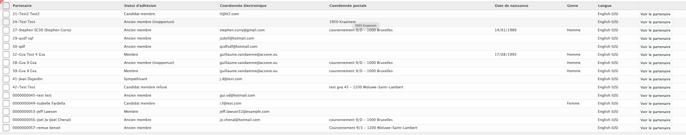

# Distribution list module

As with the standard Odoo module that allows to create mailing lists, the Mozaik distribution list module allows to create distribution lists. Its advantage compared to the standard Odoo module is that it is much more complete and powerful. The module first allows you to create a distribution list. You have to give a name to this list and you can also write a free note to this list. This module will be very useful for <a href=https://mozaik-association.github.io/mozaik/email-marketing tagret="_blank">the marketing email module</a>. 

## Include filters

!!! warning inline end "Warning"

    To be included in these lists, it is mandatory that the object has at least one email or postal address defined. Otherwise, the contact will appear in the "unreachable" tab accessible from the mailing list form.
    
A distribution list allows you to add filters that allow you to find a list of contacts that meet these filters and that will be included in the distribution list. filters can be created and saved as a template to be used for other distribution lists. Once the different filters are added, it is possible to see the list of all the contacts found by applying the different filters. These filters are dynamic, when a new person meets the criteria of the filters, this person will be automatically added in the distribution list.

## Exclude filters

As with the include filters, the exclude filters work in the same way. Simply create one or more new filters that can be saved as a template to be reused later. Once the filters are selected, you can display a list of all the contacts that will NOT be part of the distribution list.

??? tip

    By clicking on the "list result" button at the top right of the form, you can access the list of contacts that are part of the distribution list once the filters are active.
    

## Exporting

The module provides users with a tool that allows them to export a whole series of information from the contacts in the distribution list. This tool can generate a structured file (CSV) for an external printing tool (printing of membership cards)

??? tip

    You can access to this fonctionnality by clikcing on the "mass fonctionality" button in every distribution list form