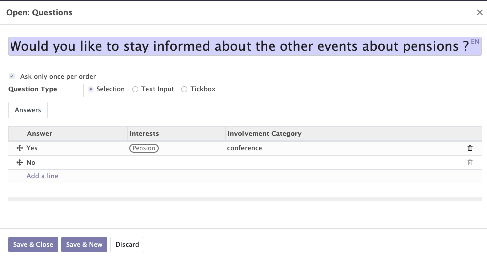

# Events

The event module uses the odoo standard and adds specific features for organisations linked to mozaik. It allows to manage the events of the orgnaisations. It will provide access to :

- The general information of the event
- The management of tickets
- The automated communications
- The list of questions
- The voting domain
- The access limitations

## General information of the event

This functionality allows you to create, modify and manage all the events related to your organisation.

Various informations can/must be completed on the petition form :

- The standard inforation of the event (name, dates, organizer...)
- The interests
- The involvement Categories

!!! abstract "The goal of petitions management"

    This fonctionnnality allows to :

    - Manage the general information of each event.
    - Add tags/interests to categorise the different events and to add these interests to the form of the contacts who participated to this event.
    - Add involvement categories to automatically add them to the form of the contacts who participated to the event.
    - Get access to the lists of all the attendees and sponsors of each event.

<figure markdown>

<figcaption>Event form with general information</figcaption>
</figure>

## Management of tickets

The fonctionnality allows to create differents types of tickets for an event. Tickets can have differents prices and different maximum number of entries. 

<figure markdown>

<figcaption>Example of tickets for an event</figcaption>
</figure>

## Automated communications

Automatic emails can be added in the "communications" tab by selecting an already created template or by creating a new one. 

!!! abstract "The goal of the the automated communication"

     This feature allows emails to be sent automatically at certain times during the event.
    !!! example

        - I would like to send a registration email immediately after each registration.
        - I would like to send a reminder email 5 days before the event. 

<figure markdown>

<figcaption>Example of tickets for an event</figcaption>
</figure>

## Questions

The module allows you to add questions in the "questions" tab that participants can or must answer. Answers can be free text, multiple choice or a tickbox.

!!! abstract "The goal of the questions"

    The questions allow you to learn more about the contacts involved to your event. 

    For the selected answers and tickboxes, it is possible to add a participation category and thesaurus themes depending on the answer chosen by the participant.  This information will be displayed on the contact's form.
    !!! example 

        People answering "yes" to the question "Would you like to stay informed about other human rights petitions?" will receive a category of participation and an interest in this subject.
        <figure markdown>
        
        <figcaption>Adding a participation category and an interest based on the response</figcaption>
        </figure>

<figure markdown>

<figcaption>Example of questions</figcaption>
</figure>