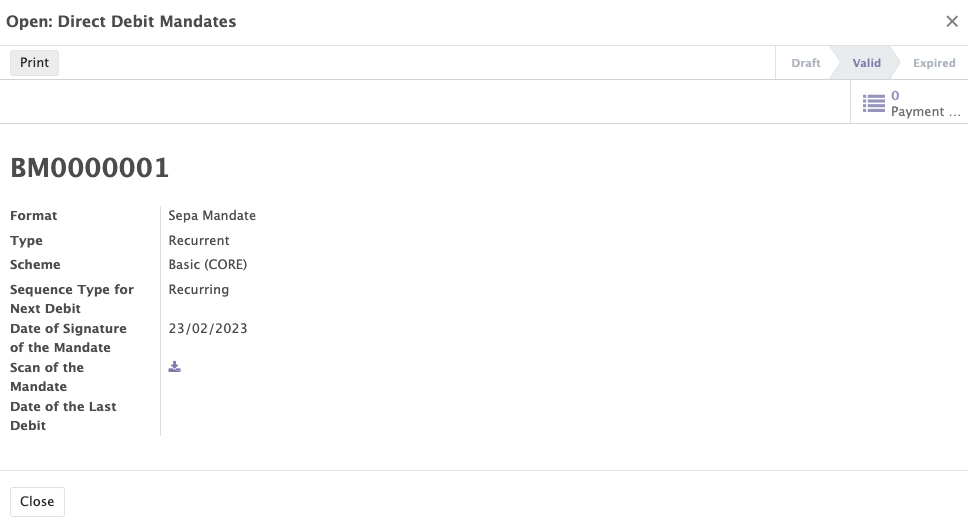
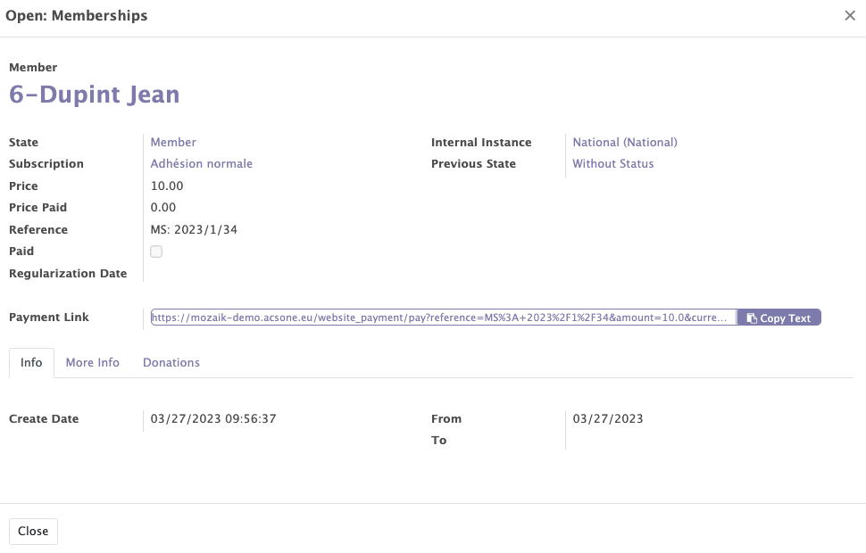

# Invoices Module

The Mozaik invoicing module includes most of the features of the standard Odoo module. This module is designed to simplify invoicing in order to get paid faster. It allows you to automatically invoice based on purchase orders, delivery orders, contracts or generated expense sheets. Odoo Invoicing also allows :

- Accept online payments.
- Eliminate the hassle of reminders for late payments.
- Simplify the configuration of automatic follow-up.
- Keep track of bank account movements and invoice status.

Mozaik offers some additional features :

- Creation of SEPA mandates
- Management tool for direct debit refusals

## Creation of SEPA mandates 

When creating a membership, you will be asked to fill in a field with a bank account number. Once this bank account is completed and the membership created, a SEPA mandate is automatically created.

## Management tool for direct debit refusals

For the payment of memberships, it is possible to create a payment link that redirects to an Odoo payment page in order to make the payment with a payment intermediary compatible with Odoo.

In the case where, for an unknown reason, a contact is refused his annual collection, a refusal management tool is activated. 

- An email is sent to the contact asking him to pay his membership since it has not been paid
- The direct debit is stopped (the mandate is cancelled) 
- A new membership line is opened

