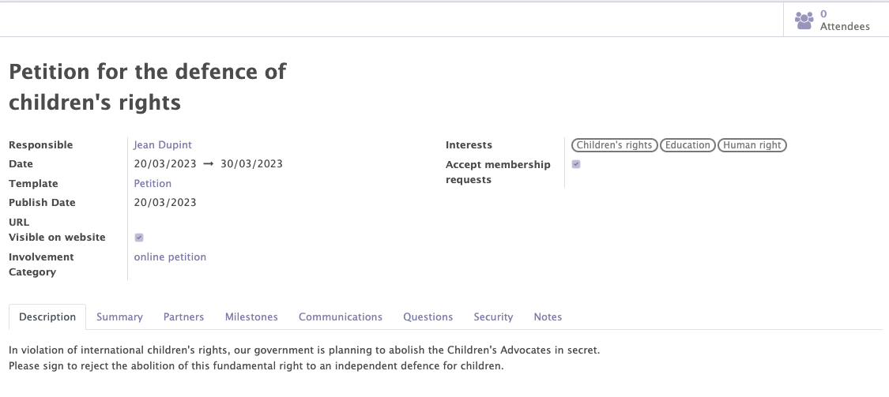
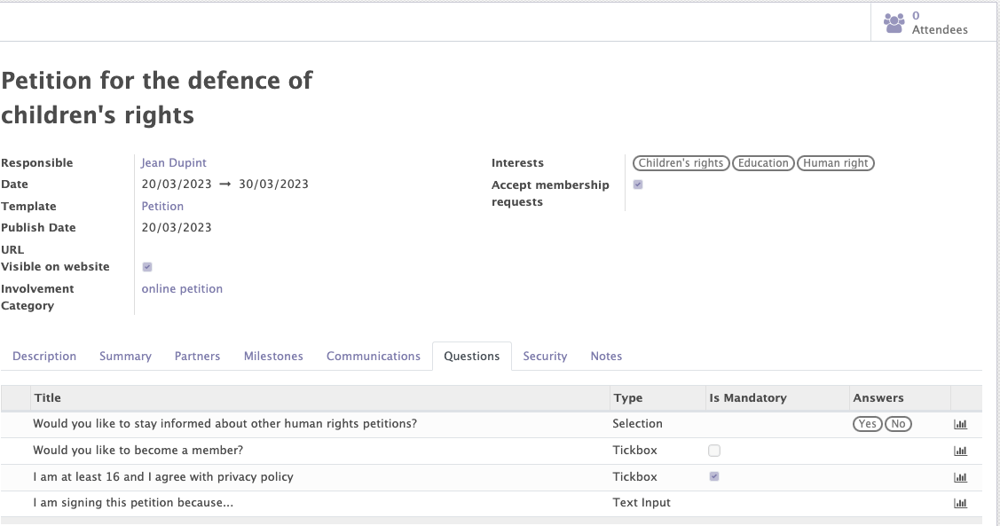

# Petitions module

The petition module is a non-existent module in the Odoo standard. It allows to manage de petitons of the orgnaisations in the back office. It will provide access to :

- The general information of the petiton
- The list of milestones 
- Automated communications
- The list of questions
- The visibility of petitions
- The recognition of parters

## General information of the petition

This functionality allows you to create, modify and manage all the petitions related to your organisation.

Various informations can/must be completed on the petition form :

- The standard information of the petiton (name, responsible, description, dates...).
- Tags 
- The involvement Categories

!!! abstract "the goal of petitions management"

    This fonctionnnality allows to :

    - Manage the general information of each petition.
    - Add tags/interests to categorise the different petitions and to add these interests to the form of the contacts who participated to this petition.
    - Add involvement categories to automatically add them to the form of the contacts who participated in the petition.
    - Get access to the lists of all the attendees/signatories of the petition.

<figure markdown>

<figcaption>Petition form with general information</figcaption>
</figure>

## Milestones

The module allows you to add different milestones (target number of signatures) to be reached for each petition.

!!! info

    At least one milestone must be added to create the petition. However, they are for information purposes only. They do not generate/create anything.

<figure markdown>

<figcaption>Example of milestones for a petition</figcaption>
</figure>

## Automated communication

Automatic emails can be added in the "communications" tab by selecting an already created template or by creating a new one. 

!!! abstract "The goal of the the automated communication"

    This feature allows emails to be sent automatically at certain times during the petition.
    !!! example

        - I would like to send an email 2 days after the end of the petition to all participants to reveal the results of the petition.
        - I want to send an email to each participant one day after their signing.

<figure markdown>

<figcaption>Example of automated communications</figcaption>
</figure>

## Questions

The module allows you to add questions in the "questions" tab that participants can or must answer. Answers can be free text, multiple choice or a tickbox.

!!! abstract "The goal of the questions"

    The questions allow you to learn more about the contacts involved in your petitions. 

    For the selected answers and tickboxes, it is possible to add a participation category and thesaurus themes depending on the answer chosen by the participant.  This information will be displayed on the contact's form.
    !!! example 

        People answering "yes" to the question "Would you like to stay informed about other human rights petitions?" will receive a category of participation and an interest in this subject.
        <figure markdown>
        
        <figcaption>Adding a participation category based on the response</figcaption>
        </figure>   

<figure markdown>

<figcaption>Example of questions</figcaption>
</figure>

## The visibility of the petition

Thanks to the "security" tab, it is possible to limit the visibility and access of each petition to certain people depending on the selected instance 

!!! example 

    I want that only people from the Antwerp instance can access the petition.

<figure markdown>

<figcaption>Example of access limitation</figcaption>
</figure>