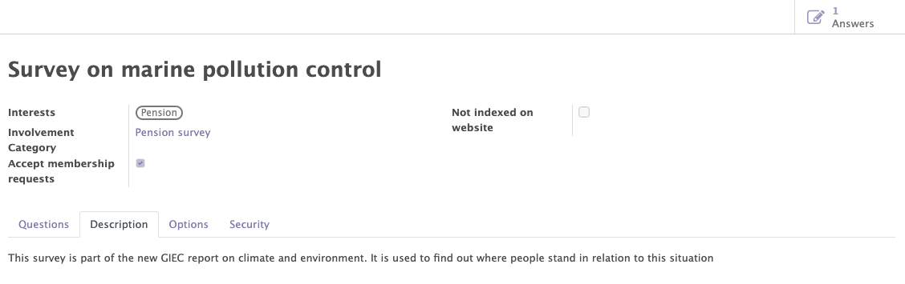

# Surveys

The survey module uses the odoo standard and adds specific features for organisations linked to mozaik. It allows to manage the surveys of the orgnaisations. It will provide access to :

- The general information of the survey.
- The management of the questions
- The recognition of parters
- The Access limitations

## General informations of the survey

This functionality allows you to create, modify and manage all the surveys related to your organisation.

Various informations can/must be completed on the survey form :

- The standard information of the survey (name, descirption...).
- The interests related to the survey.
- the involvements category related to the survey.

!!! abstract "The goal of survey management"

    This fonctionnnality allows to :

    - Manage the general information of each survey.
    - Add interests to categorise the different survey and to add these interests to the form of the contacts who participated to this survey.
    - Add involvement categories to automatically add them to the form of the contacts who participated to the survey.
    - Get access to the lists of all the answers of the survey.

<figure markdown>

<figcaption>Survey form with general information</figcaption>
</figure>

## The managment of the questions
