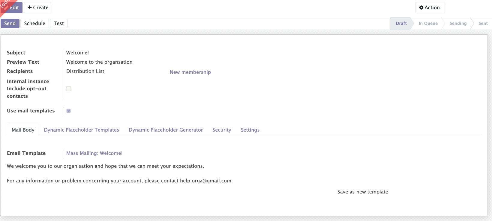

# Marketing Email

Thanks to the <a href="https://mozaik-association.github.io/mozaik/Distribution-list-module/" tagret="_blank">distribution list module</a>, Mazaik's email marketing module allows you to send emails to an exact predefined target at the exact moment. In this module, we will talk about :

- The creation of a mailing
- The follow-up of the different emails in progress
- Management of failures
- Reporting

## Creation of a mailing

When creating a mailing you will need to fill in some important information:

- A subject and an overview of the text. Example: New discount on all t-shirts - find out before it's too late
- A recipient : In this field you have the possibility to choose between several types of recipients such as a list, a distribution list that you will have to choose among the one you have created beforehand or a set of contacts that you select directly when creating the mailing thanks to filters 

Once the subject and the preview of the text are written and the recipient is chosen, you have the possibility to choose to create a mail from an Odoo template or to write a mail with a simplified mail editor. For the simplified mail editor, you also have the possibility to create mail templates in advance and simply select the one you need when creating a mailing. Thereafter, with the Odoo standard, you have the possibility to customize the content of the mail by adding personalized camps as the name or address of each recipient.

In the mailing configurations, it is possible to select the option "recurrent sending" which allows to send a mail every X time. Thanks to the filters of the distribution lists and to this functionality, you can for example automatically send an email to all the people who participated in an event in the last three days. 

??? tip

    To do this you will have to create a distribution list that includes, thanks to the filters, the people who participated in an event in the last three days. The filters being dynamic, the distribution list will be constantly updated. Once the list is created, in the mailing configuration you will have to select a recurrent mailing every 3 days

## Follow-up of the mails

The marketing email module allow you to folluw-up the stage of your differents emails in progress. The differents items are displayed in a kanban view and automatically move from one stage to another depending on whether they are still in project, pending, being sent or sent. 

## Management of failure

All communication failures must be recorded in the application. This information is visible on the record of each contact. If a contact does not receive an email sent, a communication failure will be recorded on his card.
!!! info inline end "Info"

    After a certain number of errors, the contact can be placed in a blacklist in order to not continue to send him emails that he will not receive.

- Postal returns: must be manually encoded 
- Electronic returns: records are automatic
- Unsuccessful phone calls: must be manually entered 

## Reporting

The email marketing module offers analysis of different mailings over time. It is also possible to see the details of different information such as the opening rate or the click rate of each mailing.

