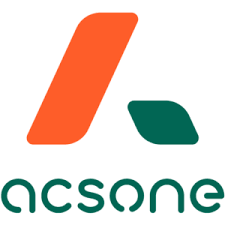

# Welcome to the Mozaik documentation

The Mozaik documentation is a tool to understand and learn the functionalities of the Mozaik project. 

## introduction to Mozaik

Mozaik is a suite of open source Odoo modules created in 2013. MOzaik is a management software for political parties. Mozaik includes a set of modules created to meet the requirements of political parties. 

The Mozaik modules allow the administrative management of a political party:

- Members 
- Sympathizers, contacts ...
- Memberships (contributions) / renewals
- Mandates (political, internal, external)
- Party structure (political / internal / external)
- Committees / elections
- Interests / competences / participations
- Retrocessions

This documentation contains all the modules of the Mozaik project explained one by one 

