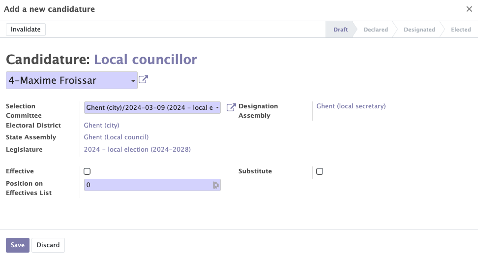

# Mandats module
This module covers the various important points concerning the management of political mandates. Several points will be discussed:

- Selection comittee
- Statuts of the mandates
- Invalidation of mandates
- Renewal of mandates

There are three types of mandates: political, internal and external. These three types of mandates are managed in a similar way. Only the data changes.

## Selection committee

In order to select a person for a term of office, the first step is to create a selection committee. It is created with a name, a state assembly, the legislature for selection, an appointment assembly, an appointment date, a term of office category and a start and end date of the term. 

Once the selection committee is created, you can add a candidate to this committee by choosing the candidate and his position on the list.

This whole part is an option offered by Mozaik to better track the election of proxies. However, it is possible to directly create a mandate without going through these steps.

## Statuts of the canddiates

Once the application is filed, the candidate has the status "declared". He can then be nominated or rejected. If he is nominated he can be elected or not elected. If the candidate is selected, then a new mandate is created. 

??? tip

    All the current and expired political mandates are available in the "state" tab --> "political mandates"

## Invalidation of mandates

The mandates are characterized by three dates: beginning of mandates, end and expiration. It is possible to invalidate the mandate, end it:

- Automatically on the expiry date
- Manually by setting an end date before the expiration date

## Renewal of mandates

It is not possible to create two same mandates at the same time for the same person. However it is possible to create another mandate for the same person, same assembly, same period but another position.

!!example

    Create a mandate of vice-Chairman in addition of a mandate of director

It is also possible to renew for the same person of an expired mandate; starting date will be positioned the day after the expiry date → no need for an application in this case. In the mandate form it is possible to add an alert delay in number of months. This allows you to be notified when a mandate is about to expire.

??? tip

    It is possible to create and retrieve all categories of mandates for political mandates - internal and external by clicking on "configurations" then "categories of mandates"

